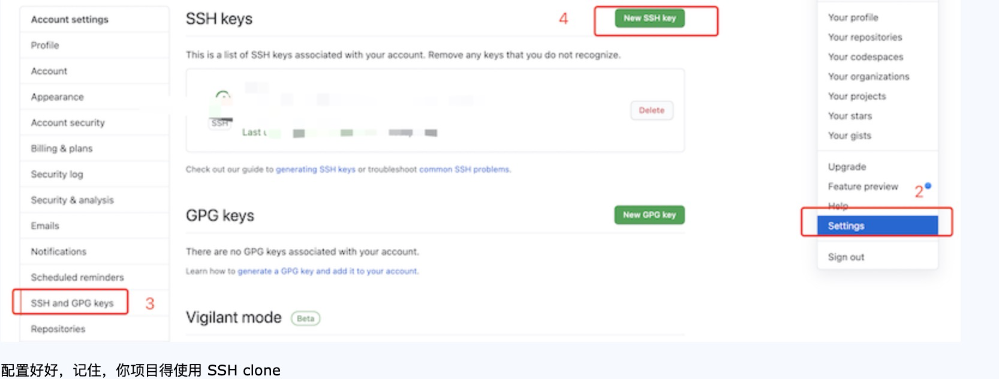
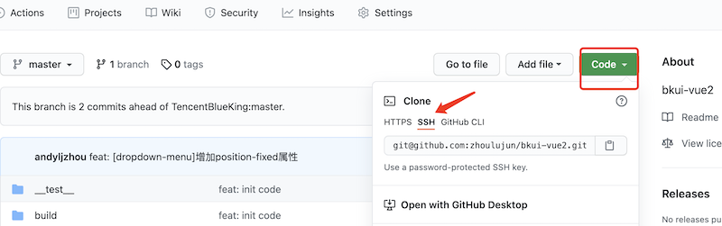
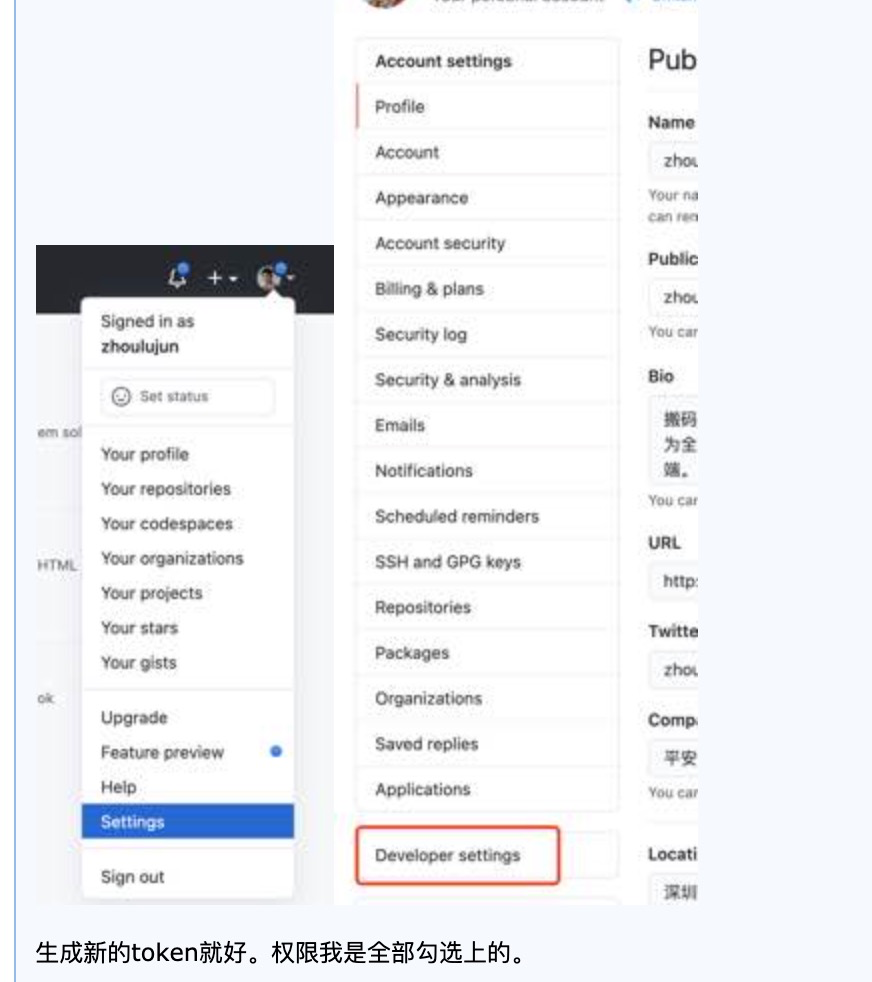
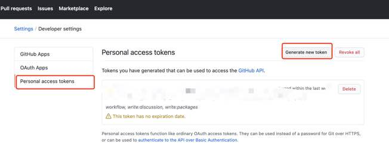

# [GitHub不再支持密码验证解决方案：SSH免密与Token登录配置](https://www.cnblogs.com/zhoulujun/p/15141608.html)


今天提交代码，push到GitHub上，突然出现这个问题。

remote: Support for password authentication was removed on August 13, 2021. Please use a personal access token instead.

remote: Please see https://github.blog/2020-12-15-token-authentication-requirements-for-git-operations/ for more information.

fatal: unable to access 'https://github.com/zhoulujun/algorithm.git/': The requested URL returned error: 403

官方的解释：https://github.blog/changelog/2021-08-12-git-password-authentication-is-shutting-down/

> As previously announced, starting on August 13, 2021, at 09:00 PST, we will no longer accept account passwords when authenticating Git operations on GitHub.com. Instead, token-based authentication (for example, personal access, OAuth, SSH Key, or GitHub App installation token) will be required for all authenticated Git operations.
>
> Please refer to this blog post for instructions on what you need to do to continue using git operations securely.
>
> **Removal**
>
> - August 13, 2021, at 09:00 PST

大致意思是，密码验证于2021年8月13日不再支持，也就是今天intellij不能再用密码方式去提交代码。请用使用 **personal access token** 替代。

这个去年年底就说了，https://github.blog/2020-12-15-token-authentication-requirements-for-git-operations/

> [In July 2020](https://github.blog/2020-07-30-token-authentication-requirements-for-api-and-git-operations/), we announced our intent to require the use of token-based authentication (for example, a personal access, OAuth, or GitHub App installation token) for all authenticated Git operations. **Beginning August 13, 2021, we will no longer accept account passwords when authenticating Git operations on GitHub.com**.

自己鼓捣了一遍 Token，烦人的很。还是觉得直接ssh 的方式操作git就好(之前是ssh的源，也没有这个问题)。


## github配置SSH免密登录

这里讲的是Mac OS 操作。windows可以借鉴 

查看ssh目录

```
ls` `-al ~/.``ssh
```

Mac OS目录~/.ssh，windows目录是： Users/uestc/.ssh/id_rsa

 -如果有配过，会列出：

-  id_rsa (私钥)——这个不能泄露
-  id_rsa.pub（公钥）

 -如果没有配过，那么就进入第二步

### 新建一个新的SSH KEY

```
ssh``-keygen -t rsa -b 4096 -C "yuanduobao@sina.com"
```

接着会提示这个公钥私钥的保存路径-建议直接回车就好（默认目录里)

接着提示输入私钥密码passphrase - 如果不想使用私钥登录的话，私钥密码为空，直接回车

生成成功后，把 id_rsa.pub 拷贝到 github 新建的 SSH keys 中








### GitHub token 

打开自己的GitHub主页，点击自己的头像找到Settings并进入，在左边目录栏找到Personal access tokens，点击Generate new token，按照步骤申请即可，过程简单。Scopes（范围）那里建议全选。

Token申请成功后，将Token复制到Token一栏中

操作路径：




