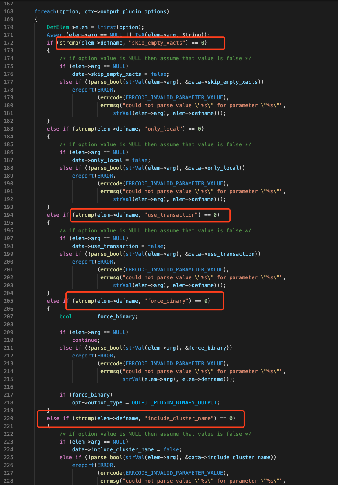
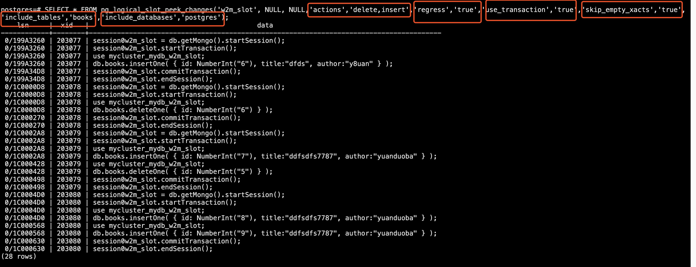
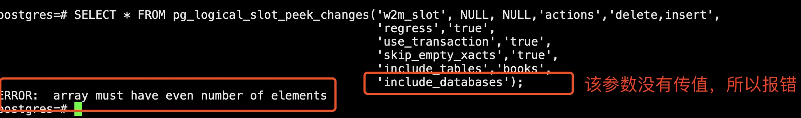
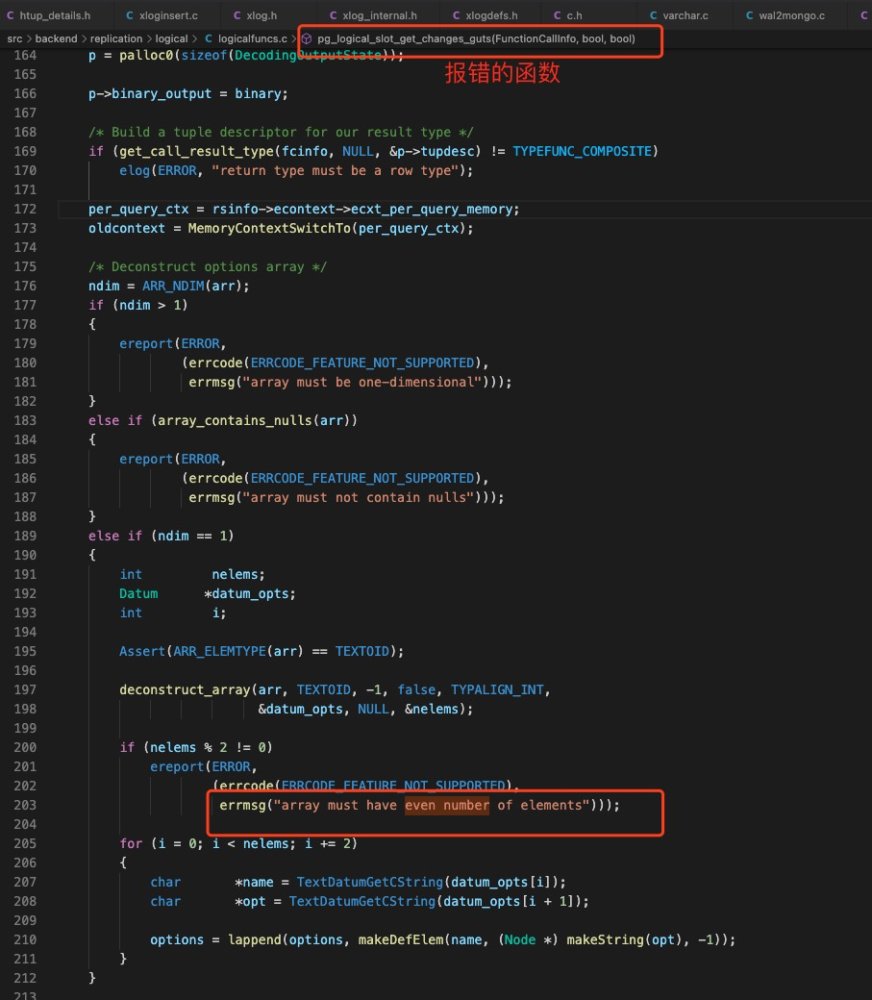

# WAL2Mongo源码解析

# PostgreSQL可变参数函数

从PostgreSQL 8.4开始，用户可以创建参数可变的函数（variadic function）。这样的函数要求可选参数是函数的最后一个参数，而且输出的参数都是相同的数据类型。如果不使用variadic function，那么我们就需要给函数传递一个数组类型的参数。


## 案例

### MySQL Concat()

例如，MySQL数据库的concat（）函数，该函数可以将传输的多个字符串连接成一个字符串。在PostgreSQL可以通过以下语句实现：

```sql
CREATE FUNCTION concat(VARIADIC param_args text[]) RETURNS text AS
$$
  SELECT array_to_string($1,'');
$$
LANGUAGE 'sql';

SELECT concat('My ', 'dog ', 'likes ', 'chocolate') As result;

result
---------------------
My dog likes chocolate
```

请注意定义函数`concat`时的关键字`VARIADIC`。


### 函数`pg_logical_slot_peek_changes`

该函数的原型如下：

```sql
pg_logical_slot_peek_changes (slot_name name, upto_lsn pg_lsn, upto_nchangesinteger, VARIADIC options text[] ) → setof record (lsn pg_lsn, xid xid, data text )
```


这样，我们就可以通过参数`options`（其实也就是一个数组`text[]`）给函数`pg_logical_slot_peek_changes`传递PostgreSQL`逻辑复制插件自定义`的参数了。比如，我们在逻辑复制插件`wal2mongo`中定义了如下参数(函数`pg_w2m_decode_startup`中的`foreach`语句处理用户自定义参数)：





我们就可以传入以下参数：

```sql
postgres=# SELECT * FROM pg_logical_slot_peek_changes('w2m_slot', NULL, NULL,'actions','delete,insert',
                                                      'regress','true',
                                                      'use_transaction','true',
                                                      'skip_empty_xacts','true',
                                                      'include_tables','books',
                                                      'include_databases','postgres');
    lsn     |  xid   |                                          data                                          
------------+--------+----------------------------------------------------------------------------------------
 0/199A3260 | 203077 | session0w2m_slot = db.getMongo().startSession();
 0/199A3260 | 203077 | session0w2m_slot.startTransaction();
 0/199A3260 | 203077 | use mycluster_mydb_w2m_slot;
 0/199A3260 | 203077 | db.books.insertOne( { id: NumberInt("6"), title:"dfds", author:"y8uan" } );
 0/199A34D8 | 203077 | session0w2m_slot.commitTransaction();
 0/199A34D8 | 203077 | session0w2m_slot.endSession();
 0/1C0000D8 | 203078 | session0w2m_slot = db.getMongo().startSession();
 0/1C0000D8 | 203078 | session0w2m_slot.startTransaction();
 0/1C0000D8 | 203078 | use mycluster_mydb_w2m_slot;
 0/1C0000D8 | 203078 | db.books.deleteOne( { id: NumberInt("6") } );
 0/1C000270 | 203078 | session0w2m_slot.commitTransaction();
 0/1C000270 | 203078 | session0w2m_slot.endSession();
 0/1C0002A8 | 203079 | session0w2m_slot = db.getMongo().startSession();
 0/1C0002A8 | 203079 | session0w2m_slot.startTransaction();
 0/1C0002A8 | 203079 | use mycluster_mydb_w2m_slot;
 0/1C0002A8 | 203079 | db.books.insertOne( { id: NumberInt("7"), title:"ddfsdfs7787", author:"yuanduoba" } );
 0/1C000428 | 203079 | use mycluster_mydb_w2m_slot;
 0/1C000428 | 203079 | db.books.deleteOne( { id: NumberInt("5") } );
 0/1C000498 | 203079 | session0w2m_slot.commitTransaction();
 0/1C000498 | 203079 | session0w2m_slot.endSession();
 0/1C0004D0 | 203080 | session0w2m_slot = db.getMongo().startSession();
 0/1C0004D0 | 203080 | session0w2m_slot.startTransaction();
 0/1C0004D0 | 203080 | use mycluster_mydb_w2m_slot;
 0/1C0004D0 | 203080 | db.books.insertOne( { id: NumberInt("8"), title:"ddfsdfs7787", author:"yuanduoba" } );
 0/1C000568 | 203080 | use mycluster_mydb_w2m_slot;
 0/1C000568 | 203080 | db.books.insertOne( { id: NumberInt("9"), title:"ddfsdfs7787", author:"yuanduoba" } );
 0/1C000630 | 203080 | session0w2m_slot.commitTransaction();
 0/1C000630 | 203080 | session0w2m_slot.endSession();
(28 rows)

postgres=# 
```




另外，函数`pg_logical_slot_peek_change`的参数options是传入自定义参数的，所以参数名和参数值必须成对出现，否则会报错，如下：




下面，我们根据报错简单的分析一下原因：

- 根据报错信息`array must have even number of elements`，查找报错的文件：

  ```c
  [root@uat-racdb01 ~]# grep -r 'array must have even number of elements'  --include='*.c'
  postgresql-13.0/contrib/hstore/hstore_io.c:						 errmsg("array must have even number of elements")));
  postgresql-13.0/src/backend/replication/logical/logicalfuncs.c:					 errmsg("array must have even number of elements")));
  postgresql-13.0/src/backend/utils/adt/jsonb.c:						 errmsg("array must have even number of elements")));
  postgresql-13.0/src/backend/utils/adt/json.c:						 errmsg("array must have even number of elements")));
  [root@uat-racdb01 ~]# 
  ```

  显然，跟该报错相关的文件只有三个，而且看文件名似乎只有一个跟逻辑复制相关，所以我们就查看文件`src/backend/replication/logical/logicalfuncs.c`，发现是函数`pg_logical_slot_get_changes_gnuts()`报错。




# 数据结构

## `Wal2MongoAction`

该结构体用于存储用于传入的参数，逻辑解码的时候需要解析insert、update、delete、truncate等操作中的哪些sql语句：

```c
/*
 * 在解析wal日志时，哪些sql语句需要生成MongoDB语句，
 * 这几个结构体变量的值可以由postgresql数据库用户在调用逻辑复制管理函数（比如pg_logical_slot_peek_changes传入）
 * 如果用户没有指定，则默认支持insert、update、delete语句，truncate语句暂时没有处理。
 */
typedef struct
{
	bool 		insert;
	bool		update;
	bool		delete;
	bool		truncate;
} Wal2MongoAction;
```


比如，我们只需要查看`delete`语句，那么就只需要设置参数`actions`的值为`delete`：

```sql
postgres=# SELECT * FROM pg_logical_slot_peek_changes('w2m_slot', NULL, NULL,'actions','delete'); lsn | xid | data 
-----+-----+------
(0 rows)

postgres=#
```


如果，我们想查看`insert`、`delete`语句：

```sql
postgres=# SELECT * FROM pg_logical_slot_peek_changes('w2m_slot', NULL, NULL,'actions','delete,insert');
    lsn    | xid |                                            data                                             
-----------+-----+---------------------------------------------------------------------------------------------
 0/201B218 | 488 | use pg12cluster_postgres_w2m_slot;
 0/201B218 | 488 | db.books.insertOne( { id: NumberInt("123"), title:"HG-PGSQL1.1", author:"Highgo" } );
 0/2034DC0 | 490 | use pg12cluster_postgres_w2m_slot;
 0/2034DC0 | 490 | db.test_wal2mongo.insertOne( { id: NumberInt("1"), name:"test", age: NumberInt("33") } );
 0/2034F10 | 491 | use pg12cluster_postgres_w2m_slot;
 0/2034F10 | 491 | db.test_wal2mongo.insertOne( { id: NumberInt("12"), name:"test2", age: NumberInt("33") } );
(6 rows)

postgres=# 
```


## 结构体`Wal2MongoData`

该结构体用于接收用于调用逻辑复制函数传入的一些控制参数，比如是否`跳过空事务`、`生成的Mongodb的数据库名字是否包含postgresql数据库集群的名字`、``

- 生成的MongoDB的db名字：

```c
pg集群名/mycluster+_+pg数据库名/mydb+_+slot名字
```


- 数据结构

```c
typedef struct
{
	MemoryContext context;
	bool		skip_empty_xacts;    /* 是否跳过空事务 */
	bool		xact_wrote_changes;
	bool		only_local;
	bool 		use_transaction;    /* 生成的MongoDB是否使用事务begin/commit语句 */
	bool		include_cluster_name;   /* Mongodb的数据库名字是否包含pg的集群名 */  
	bool		regress;   /* 如果为true，则MongoDB的数据库名使用mycluster带起PG集群名，同时，使用mydb代替pg的数据库名 */
	Wal2MongoAction	actions;
	uint32      cnt;    /* 当前需要输出的MongoDB语句数，跳过的语句不计入该计数器. */
	StringInfo  tempSessionSts;     /* 如果开启了事务模式，暂存Session语句. */
	StringInfo  tempBeginSts;    /* 如果开启了事务模式，暂存事务开始语句 */
	StringInfo  tempUseSts;      /* 临时存放MongoDB的use语句. */
	List        *includeTables;   /* 由用户指定需要解析哪些表，默认解析所有的表. */
	List        *excludeTables;   /* 由用户指定哪些表需要跳过不解析，默认所有的表都需要解析. */
	List        *includeDatabases;  /* 指定只解析哪些db。 */
	List        *excludeDatabases;  /* 指定哪些db不解析。 */
} Wal2MongoData;

```


- 生成MongoDB数据库名的代码

  ```c
  	/* Here we are concatenating ClusterName, DatabaseName, and SlotName to form
  	 * a unified database name in MongoDB's perspective, so Mongo knows the changes
  	 * are streamed from which cluster, which database and via which slot
  	 *
  	 * TODO: we will introduce more configurable options to fine-tune this output style
  	 * behaviors.
  	 */
  	if(data->include_cluster_name)
  	{
  		char *cluster_name = GetConfigOptionByName("cluster_name", NULL, true);
  
  		appendStringInfo(ctx->out, "use %s_%s_%s;",
  						data->regress == true ? "mycluster" : (cluster_name[0] == '\0' ? "mycluster" : cluster_name),
  						data->regress == true ? "mydb" : get_database_name(relation->rd_node.dbNode),
  						ctx->slot->data.name.data[0] == '\0' ? "myslot" :
  								ctx->slot->data.name.data);
  	}
  	else
  	{
  		appendStringInfo(ctx->out, "use %s_%s;",
  						data->regress == true ? "mydb" : get_database_name(relation->rd_node.dbNode),
  						ctx->slot->data.name.data[0] == '\0' ? "myslot" :
  								ctx->slot->data.name.data);
  	}
  ```

  


# 动态加载函数库

## Linux系统的函数dlsym()

```sh
DLOPEN(3)                                                 Linux Programmer's Manual                                                 DLOPEN(3)

NAME
       dladdr, dlclose, dlerror, dlopen, dlsym, dlvsym - programming interface to dynamic linking loader

SYNOPSIS
       #include <dlfcn.h>

       void *dlopen(const char *filename, int flag);

       char *dlerror(void);

       void *dlsym(void *handle, const char *symbol);

       int dlclose(void *handle);

       Link with -ldl.

DESCRIPTION
       The four functions dlopen(), dlsym(), dlclose(), dlerror() implement the interface to the dynamic linking loader.

   dlerror()
       The  function  dlerror()  returns  a  human  readable  string describing the most recent error that occurred from dlopen(), dlsym() or
       dlclose() since the last call to dlerror().  It returns NULL if no errors have occurred since initialization  or  since  it  was  last
       called.

   dlopen()
       The  function  dlopen() loads the dynamic library file named by the null-terminated string filename and returns an opaque "handle" for
       the dynamic library.  If filename is NULL, then the returned handle is for the main program.  If filename contains a slash ("/"), then
       it  is  interpreted  as  a  (relative  or  absolute) pathname.  Otherwise, the dynamic linker searches for the library as follows (see
       ld.so(8) for further details):

       o   (ELF only) If the executable file for the calling program contains a DT_RPATH tag, and does not contain a DT_RUNPATH tag, then the
           directories listed in the DT_RPATH tag are searched.

       o   If,  at  the  time that the program was started, the environment variable LD_LIBRARY_PATH was defined to contain a colon-separated
           list of directories, then these are searched.  (As a security measure this variable is ignored for  set-user-ID  and  set-group-ID
           programs.)

       o   (ELF  only)  If the executable file for the calling program contains a DT_RUNPATH tag, then the directories listed in that tag are
           searched.

       o   The cache file /etc/ld.so.cache (maintained by ldconfig(8)) is checked to see whether it contains an entry for filename.

       o   The directories /lib and /usr/lib are searched (in that order).

       If the library has dependencies on other shared libraries, then these are also automatically loaded by the dynamic  linker  using  the
       same rules.  (This process may occur recursively, if those libraries in turn have dependencies, and so on.)

       One of the following two values must be included in flag:

       RTLD_LAZY
              Perform  lazy  binding.  Only resolve symbols as the code that references them is executed.  If the symbol is never referenced,
              then it is never resolved.  (Lazy binding is performed only for function references; references to variables are always immedi‐
              ately bound when the library is loaded.)

       RTLD_NOW
              If  this  value is specified, or the environment variable LD_BIND_NOW is set to a nonempty string, all undefined symbols in the
              library are resolved before dlopen() returns.  If this cannot be done, an error is returned.

       Zero or more of the following values may also be ORed in flag:

       RTLD_GLOBAL
              The symbols defined by this library will be made available for symbol resolution of subsequently loaded libraries.

       RTLD_LOCAL
              This is the converse of RTLD_GLOBAL, and the default if neither flag is specified.  Symbols defined in  this  library  are  not
              made available to resolve references in subsequently loaded libraries.

       RTLD_NODELETE (since glibc 2.2)
              Do  not unload the library during dlclose().  Consequently, the library's static variables are not reinitialized if the library
              is reloaded with dlopen() at a later time.  This flag is not specified in POSIX.1-2001.

       RTLD_NOLOAD (since glibc 2.2)
              Don't load the library.  This can be used to test if the library is already resident (dlopen() returns NULL if it  is  not,  or
              the  library's handle if it is resident).  This flag can also be used to promote the flags on a library that is already loaded.
              For example, a library that was previously loaded with RTLD_LOCAL can be reopened with RTLD_NOLOAD | RTLD_GLOBAL.  This flag is
              not specified in POSIX.1-2001.

       RTLD_DEEPBIND (since glibc 2.3.4)
              Place the lookup scope of the symbols in this library ahead of the global scope.  This means that a self-contained library will
              use its own symbols in preference to global symbols with the same name contained in libraries that have  already  been  loaded.
              This flag is not specified in POSIX.1-2001.

       If  filename  is a NULL pointer, then the returned handle is for the main program.  When given to dlsym(), this handle causes a search
       for a symbol in the main program, followed by all shared libraries loaded at program startup, and then all shared libraries loaded  by
       dlopen() with the flag RTLD_GLOBAL.

       External  references  in the library are resolved using the libraries in that library's dependency list and any other libraries previ‐
       ously  opened  with  the  RTLD_GLOBAL  flag.   If  the  executable  was  linked  with  the   flag   "-rdynamic"   (or,   synonymously,
       "--export-dynamic"),  then  the  global  symbols  in  the  executable  will also be used to resolve references in a dynamically loaded
       library.

       If the same library is loaded again with dlopen(), the same file handle is returned.  The dl library maintains  reference  counts  for
       library handles, so a dynamic library is not deallocated until dlclose() has been called on it as many times as dlopen() has succeeded
       on it.  The _init() routine, if present, is called only once.  But a subsequent call with RTLD_NOW may force symbol resolution  for  a
       library earlier loaded with RTLD_LAZY.

       If dlopen() fails for any reason, it returns NULL.

   dlsym()
       The  function  dlsym()  takes  a "handle" of a dynamic library returned by dlopen() and the null-terminated symbol name, returning the
       address where that symbol is loaded into memory.  If the symbol is not found, in the specified library or any of  the  libraries  that
       were automatically loaded by dlopen() when that library was loaded, dlsym() returns NULL.  (The search performed by dlsym() is breadth
       first through the dependency tree of these libraries.)  Since the value of the symbol could actually be NULL (so that  a  NULL  return
       from dlsym() need not indicate an error), the correct way to test for an error is to call dlerror() to clear any old error conditions,
       then call dlsym(), and then call dlerror() again, saving its return value into a variable, and check whether this saved value  is  not
       NULL.

       There  are  two  special  pseudo-handles, RTLD_DEFAULT and RTLD_NEXT.  The former will find the first occurrence of the desired symbol
       using the default library search order.  The latter will find the next occurrence of a function in the search order after the  current
       library.  This allows one to provide a wrapper around a function in another shared library.

   dlclose()
       The  function dlclose() decrements the reference count on the dynamic library handle handle.  If the reference count drops to zero and
       no other loaded libraries use symbols in it, then the dynamic library is unloaded.

       The function dlclose() returns 0 on success, and nonzero on error.

   The obsolete symbols _init() and _fini()
       The linker recognizes special symbols _init and _fini.  If a dynamic library exports a routine named _init(), then that code  is  exe‐
       cuted after the loading, before dlopen() returns.  If the dynamic library exports a routine named _fini(), then that routine is called
       just before the library is unloaded.  In case you need to avoid linking against the system startup files, this can be  done  by  using
       the gcc(1) -nostartfiles command-line option.

       Using  these routines, or the gcc -nostartfiles or -nostdlib options, is not recommended.  Their use may result in undesired behavior,
       since the constructor/destructor routines will not be executed (unless special measures are taken).

       Instead, libraries should export routines using the __attribute__((constructor)) and __attribute__((destructor)) function  attributes.
       See  the  gcc info pages for information on these.  Constructor routines are executed before dlopen() returns, and destructor routines
       are executed before dlclose() returns.

   Glibc extensions: dladdr() and dlvsym()
       Glibc adds two functions not described by POSIX, with prototypes

       #define _GNU_SOURCE         /* See feature_test_macros(7) */
       #include <dlfcn.h>

       int dladdr(void *addr, Dl_info *info);

       void *dlvsym(void *handle, char *symbol, char *version);

       The function dladdr() takes a function pointer and tries to resolve name and file where it is located.  Information is stored  in  the
       Dl_info structure:

           typedef struct {
               const char *dli_fname;  /* Pathname of shared object that
                                          contains address */
               void       *dli_fbase;  /* Address at which shared object
                                          is loaded */
               const char *dli_sname;  /* Name of nearest symbol with address
                                          lower than addr */
               void       *dli_saddr;  /* Exact address of symbol named
                                          in dli_sname */
           } Dl_info;

       If no symbol matching addr could be found, then dli_sname and dli_saddr are set to NULL.

       dladdr() returns 0 on error, and nonzero on success.

       The function dlvsym(), provided by glibc since version 2.1, does the same as dlsym() but takes a version string as an additional argu‐
       ment.

CONFORMING TO
       POSIX.1-2001 describes dlclose(), dlerror(), dlopen(), and dlsym().

NOTES
       The symbols RTLD_DEFAULT and RTLD_NEXT are defined by <dlfcn.h> only when _GNU_SOURCE was defined before including it.

       Since glibc 2.2.3, atexit(3) can be used to register an exit handler that is automatically called when a library is unloaded.

   History
       The dlopen interface standard comes from SunOS.  That system also has dladdr(), but not dlvsym().

BUGS
       Sometimes, the function pointers you pass to dladdr() may surprise you.  On some architectures (notably i386  and  x86_64),  dli_fname
       and  dli_fbase  may end up pointing back at the object from which you called dladdr(), even if the function used as an argument should
       come from a dynamically linked library.

       The problem is that the function pointer will still be resolved at compile time, but merely point to the plt (Procedure Linkage Table)
       section  of  the  original  object  (which dispatches the call after asking the dynamic linker to resolve the symbol).  To work around
       this, you can try to compile the code to be position-independent: then, the compiler cannot prepare the pointer at compile  time  any‐
       more  and  today's  gcc(1)  will generate code that just loads the final symbol address from the got (Global Offset Table) at run time
       before passing it to dladdr().

EXAMPLE
       Load the math library, and print the cosine of 2.0:

       #include <stdio.h>
       #include <stdlib.h>
       #include <dlfcn.h>

       int
       main(int argc, char **argv)
       {
           void *handle;
           double (*cosine)(double);
           char *error;

           handle = dlopen("libm.so", RTLD_LAZY);
           if (!handle) {
               fprintf(stderr, "%s\n", dlerror());
               exit(EXIT_FAILURE);
           }

           dlerror();    /* Clear any existing error */

           /* Writing: cosine = (double (*)(double)) dlsym(handle, "cos");
              would seem more natural, but the C99 standard leaves
              casting from "void *" to a function pointer undefined.
              The assignment used below is the POSIX.1-2003 (Technical
              Corrigendum 1) workaround; see the Rationale for the
              POSIX specification of dlsym(). */

           *(void **) (&cosine) = dlsym(handle, "cos");

           if ((error = dlerror()) != NULL)  {
               fprintf(stderr, "%s\n", error);
               exit(EXIT_FAILURE);
           }

           printf("%f\n", (*cosine)(2.0));
           dlclose(handle);
           exit(EXIT_SUCCESS);
       }
           handle = dlopen("libm.so", RTLD_LAZY);
           if (!handle) {
               fprintf(stderr, "%s\n", dlerror());
               exit(EXIT_FAILURE);
           }

           dlerror();    /* Clear any existing error */

           /* Writing: cosine = (double (*)(double)) dlsym(handle, "cos");
              would seem more natural, but the C99 standard leaves
              casting from "void *" to a function pointer undefined.
              The assignment used below is the POSIX.1-2003 (Technical
              Corrigendum 1) workaround; see the Rationale for the
              POSIX specification of dlsym(). */

           *(void **) (&cosine) = dlsym(handle, "cos");

           if ((error = dlerror()) != NULL)  {
               fprintf(stderr, "%s\n", error);
               exit(EXIT_FAILURE);
           }

           printf("%f\n", (*cosine)(2.0));
           dlclose(handle);
           exit(EXIT_SUCCESS);
       }

       If this program were in a file named "foo.c", you would build the program with the following command:

           gcc -rdynamic -o foo foo.c -ldl

       Libraries exporting _init() and _fini() will want to be compiled as follows, using bar.c as the example name:

           gcc -shared -nostartfiles -o bar bar.c

SEE ALSO
       ld(1), ldd(1), dl_iterate_phdr(3), rtld-audit(7), ld.so(8), ldconfig(8)

       ld.so info pages, gcc info pages, ld info pages

COLOPHON
       This page is part of release 3.53 of the Linux man-pages project.  A description of the project, and information about reporting bugs,
       can be found at http://www.kernel.org/doc/man-pages/.
```


# 创建`slot`

通过以下语句创建一个`slot`，从而将插件`wal2mongo`插件`extension`跟创建的复制槽`w2m_slot`关联起来：

```sql
postgres=# SELECT * FROM pg_create_logical_replication_slot('w2m_slot', 'wal2mongo');
 slot_name |    lsn     
-----------+------------
 w2m_slot  | 1/3CB04148
(1 row)
```

注意：函数`pg_create_logical_replication_slot`的第二个参数`wal2mongo`就是创建的名称。


# 动态库接口函数

## `_PG_init`

PostgreSQL在源文件`src/backend/utils/fmgr/dfmgr.c`中加载库文件的时候，会执行库文件中的函数`_PG_init`，如下：

```c
/*
 * Load the specified dynamic-link library file, unless it already is
 * loaded.  Return the pg_dl* handle for the file.
 *
 * Note: libname is expected to be an exact name for the library file.
 */
static void *
internal_load_library(const char *libname)
{
	DynamicFileList *file_scanner;
	PGModuleMagicFunction magic_func;
	char	   *load_error;
	struct stat stat_buf;
	PG_init_t	PG_init;

	/*
	 * Scan the list of loaded FILES to see if the file has been loaded.
	 */
	for (file_scanner = file_list;
		 file_scanner != NULL &&
		 strcmp(libname, file_scanner->filename) != 0;
		 file_scanner = file_scanner->next)
		;

	if (file_scanner == NULL)
	{
		/*
		 * Check for same files - different paths (ie, symlink or link)
		 */
		if (stat(libname, &stat_buf) == -1)
			ereport(ERROR,
					(errcode_for_file_access(),
					 errmsg("could not access file \"%s\": %m",
							libname)));

		for (file_scanner = file_list;
			 file_scanner != NULL &&
			 !SAME_INODE(stat_buf, *file_scanner);
			 file_scanner = file_scanner->next)
			;
	}

	if (file_scanner == NULL)
	{
		/*
		 * File not loaded yet.
		 */
		file_scanner = (DynamicFileList *)
			malloc(offsetof(DynamicFileList, filename) + strlen(libname) + 1);
		if (file_scanner == NULL)
			ereport(ERROR,
					(errcode(ERRCODE_OUT_OF_MEMORY),
					 errmsg("out of memory")));

		MemSet(file_scanner, 0, offsetof(DynamicFileList, filename));
		strcpy(file_scanner->filename, libname);
		file_scanner->device = stat_buf.st_dev;
#ifndef WIN32
		file_scanner->inode = stat_buf.st_ino;
#endif
		file_scanner->next = NULL;

		file_scanner->handle = dlopen(file_scanner->filename, RTLD_NOW | RTLD_GLOBAL);
		if (file_scanner->handle == NULL)
		{
			load_error = dlerror();
			free((char *) file_scanner);
			/* errcode_for_file_access might not be appropriate here? */
			ereport(ERROR,
					(errcode_for_file_access(),
					 errmsg("could not load library \"%s\": %s",
							libname, load_error)));
		}

		/* Check the magic function to determine compatibility */
		magic_func = (PGModuleMagicFunction)
			dlsym(file_scanner->handle, PG_MAGIC_FUNCTION_NAME_STRING);
		if (magic_func)
		{
			const Pg_magic_struct *magic_data_ptr = (*magic_func) ();

			if (magic_data_ptr->len != magic_data.len ||
				memcmp(magic_data_ptr, &magic_data, magic_data.len) != 0)
			{
				/* copy data block before unlinking library */
				Pg_magic_struct module_magic_data = *magic_data_ptr;

				/* try to close library */
				dlclose(file_scanner->handle);
				free((char *) file_scanner);

				/* issue suitable complaint */
				incompatible_module_error(libname, &module_magic_data);
			}
		}
		else
		{
			/* try to close library */
			dlclose(file_scanner->handle);
			free((char *) file_scanner);
			/* complain */
			ereport(ERROR,
					(errmsg("incompatible library \"%s\": missing magic block",
							libname),
					 errhint("Extension libraries are required to use the PG_MODULE_MAGIC macro.")));
		}

		/*
		 * If the library has a _PG_init() function, call it.
		 */
		PG_init = (PG_init_t) dlsym(file_scanner->handle, "_PG_init");
		if (PG_init)
			(*PG_init) ();

		/* OK to link it into list */
		if (file_list == NULL)
			file_list = file_scanner;
		else
			file_tail->next = file_scanner;
		file_tail = file_scanner;
	}

	return file_scanner->handle;
}
```


## `_PG_output_plugin_init`

逻辑复制插件必须定义的初始化函数`_PG_output_plugin_init`，在该函数中初始化结构体变量`OutputPluginCallbacks *cb`，该结构体就是存放一些自定义的回调函数。

- 在该初始化函数中设置回调函数

  ```c
  /* Initialize callback functions */
  void
  _PG_output_plugin_init(OutputPluginCallbacks *cb)
  {
  	AssertVariableIsOfType(&_PG_output_plugin_init, LogicalOutputPluginInit);
  
  	cb->startup_cb = pg_w2m_decode_startup;      /* 在该回调函数中初始我们自己定义的变量 */
  	cb->begin_cb = pg_w2m_decode_begin_txn;
  	cb->change_cb = pg_w2m_decode_change;     /* 每条wal日志都会调用该函数 */
  	cb->truncate_cb = pg_w2m_decode_truncate;
  	cb->commit_cb = pg_w2m_decode_commit_txn;
  	cb->filter_by_origin_cb = pg_w2m_decode_filter;
  	cb->shutdown_cb = pg_w2m_decode_shutdown;
  	cb->message_cb = pg_w2m_decode_message;
  }
  ```

  

- 函数调用流程：

```sh
CreateDecodingContext、CreateInitDecodingContext  -> StartupDecodingContext -> LoadOutputPlugin -> load_external_function -> dlsym() --加载--> _PG_output_plugin_init
```


- 回调函数接口`OutputPluginCallbacks`

```c
/*
 * Output plugin callbacks
 */
typedef struct OutputPluginCallbacks
{
	LogicalDecodeStartupCB startup_cb;
	LogicalDecodeBeginCB begin_cb;
	LogicalDecodeChangeCB change_cb;
	LogicalDecodeTruncateCB truncate_cb;
	LogicalDecodeCommitCB commit_cb;
	LogicalDecodeMessageCB message_cb;
	LogicalDecodeFilterByOriginCB filter_by_origin_cb;
	LogicalDecodeShutdownCB shutdown_cb;
} OutputPluginCallbacks;
```


# 回调函数原型

```c

/*
 * Type of the shared library symbol _PG_output_plugin_init that is looked up
 * when loading an output plugin shared library.
 */
typedef void (*LogicalOutputPluginInit) (struct OutputPluginCallbacks *cb);

/*
 * Callback that gets called in a user-defined plugin. ctx->private_data can
 * be set to some private data.
 *
 * "is_init" will be set to "true" if the decoding slot just got defined. When
 * the same slot is used from there one, it will be "false".
 */
typedef void (*LogicalDecodeStartupCB) (struct LogicalDecodingContext *ctx,
										OutputPluginOptions *options,
										bool is_init);

/*
 * Callback called for every (explicit or implicit) BEGIN of a successful
 * transaction.
 */
typedef void (*LogicalDecodeBeginCB) (struct LogicalDecodingContext *ctx,
									  ReorderBufferTXN *txn);

/*
 * Callback for every individual change in a successful transaction.
 */
typedef void (*LogicalDecodeChangeCB) (struct LogicalDecodingContext *ctx,
									   ReorderBufferTXN *txn,
									   Relation relation,
									   ReorderBufferChange *change);

/*
 * Callback for every TRUNCATE in a successful transaction.
 */
typedef void (*LogicalDecodeTruncateCB) (struct LogicalDecodingContext *ctx,
										 ReorderBufferTXN *txn,
										 int nrelations,
										 Relation relations[],
										 ReorderBufferChange *change);

/*
 * Called for every (explicit or implicit) COMMIT of a successful transaction.
 */
typedef void (*LogicalDecodeCommitCB) (struct LogicalDecodingContext *ctx,
									   ReorderBufferTXN *txn,
									   XLogRecPtr commit_lsn);

/*
 * Called for the generic logical decoding messages.
 */
typedef void (*LogicalDecodeMessageCB) (struct LogicalDecodingContext *ctx,
										ReorderBufferTXN *txn,
										XLogRecPtr message_lsn,
										bool transactional,
										const char *prefix,
										Size message_size,
										const char *message);

/*
 * Filter changes by origin.
 */
typedef bool (*LogicalDecodeFilterByOriginCB) (struct LogicalDecodingContext *ctx,
											   RepOriginId origin_id);

/*
 * Called to shutdown an output plugin.
 */
typedef void (*LogicalDecodeShutdownCB) (struct LogicalDecodingContext *ctx);
```


源文件`src/backend/replication/logical/logical.c`中的函数`LoadOutputPlugin`会加载插件初始化函数`_PG_output_plugin_init`:

```c
/*
 * Load the output plugin, lookup its output plugin init function, and check
 * that it provides the required callbacks.
 */
static void
LoadOutputPlugin(OutputPluginCallbacks *callbacks, char *plugin)
{
	LogicalOutputPluginInit plugin_init;

	plugin_init = (LogicalOutputPluginInit)
		load_external_function(plugin, "_PG_output_plugin_init", false, NULL);

	if (plugin_init == NULL)
		elog(ERROR, "output plugins have to declare the _PG_output_plugin_init symbol");

	/* ask the output plugin to fill the callback struct */
	plugin_init(callbacks);

	if (callbacks->begin_cb == NULL)
		elog(ERROR, "output plugins have to register a begin callback");
	if (callbacks->change_cb == NULL)
		elog(ERROR, "output plugins have to register a change callback");
	if (callbacks->commit_cb == NULL)
		elog(ERROR, "output plugins have to register a commit callback");
}
```


以下两个函数会调用函数`StartupDecodingContext`

- `src/backend/replication/logical/logical.c`

```c
/*
 * Create a new decoding context, for a logical slot that has previously been
 * used already.
 *
 * start_lsn
 *		The LSN at which to start decoding.  If InvalidXLogRecPtr, restart
 *		from the slot's confirmed_flush; otherwise, start from the specified
 *		location (but move it forwards to confirmed_flush if it's older than
 *		that, see below).
 *
 * output_plugin_options
 *		options passed to the output plugin.
 *
 * fast_forward
 *		bypass the generation of logical changes.
 *
 * xl_routine
 *		XLogReaderRoutine used by underlying xlogreader
 *
 * prepare_write, do_write, update_progress
 *		callbacks that have to be filled to perform the use-case dependent,
 *		actual work.
 *
 * Needs to be called while in a memory context that's at least as long lived
 * as the decoding context because further memory contexts will be created
 * inside it.
 *
 * Returns an initialized decoding context after calling the output plugin's
 * startup function.
 */
LogicalDecodingContext *
CreateDecodingContext(XLogRecPtr start_lsn,
					  List *output_plugin_options,
					  bool fast_forward,
					  XLogReaderRoutine *xl_routine,
					  LogicalOutputPluginWriterPrepareWrite prepare_write,
					  LogicalOutputPluginWriterWrite do_write,
					  LogicalOutputPluginWriterUpdateProgress update_progress)
```


```c
/*
 * Create a new decoding context, for a new logical slot.
 *
 * plugin -- contains the name of the output plugin
 * output_plugin_options -- contains options passed to the output plugin
 * need_full_snapshot -- if true, must obtain a snapshot able to read all
 *		tables; if false, one that can read only catalogs is acceptable.
 * restart_lsn -- if given as invalid, it's this routine's responsibility to
 *		mark WAL as reserved by setting a convenient restart_lsn for the slot.
 *		Otherwise, we set for decoding to start from the given LSN without
 *		marking WAL reserved beforehand.  In that scenario, it's up to the
 *		caller to guarantee that WAL remains available.
 * xl_routine -- XLogReaderRoutine for underlying XLogReader
 * prepare_write, do_write, update_progress --
 *		callbacks that perform the use-case dependent, actual, work.
 *
 * Needs to be called while in a memory context that's at least as long lived
 * as the decoding context because further memory contexts will be created
 * inside it.
 *
 * Returns an initialized decoding context after calling the output plugin's
 * startup function.
 */
LogicalDecodingContext *
CreateInitDecodingContext(char *plugin,
						  List *output_plugin_options,
						  bool need_full_snapshot,
						  XLogRecPtr restart_lsn,
						  XLogReaderRoutine *xl_routine,
						  LogicalOutputPluginWriterPrepareWrite prepare_write,
						  LogicalOutputPluginWriterWrite do_write,
						  LogicalOutputPluginWriterUpdateProgress update_progress)
```


# 回调函数

## 回调函数`pg_w2m_decode_startup`

该函数负责初始化我们定义的参数，解析用户传入的参数列表`ctx->output_plugin_options`，赋给变量`ctx-output_plugin_private`，后续其他回调函数可以继续使用变量`ctx-output_plugin_private`。

```c
/* Initialize this plugin's resources */
static void
pg_w2m_decode_startup(LogicalDecodingContext *ctx, OutputPluginOptions *opt,
				  	  bool is_init)
{
	ListCell   *option;
	Wal2MongoData *data;

	data = palloc0(sizeof(Wal2MongoData));
	data->context = AllocSetContextCreate(ctx->context,
										  "wal2mongo context",
										  ALLOCSET_DEFAULT_SIZES);
	data->skip_empty_xacts = false;
	data->only_local = false;
	data->use_transaction = false;
	data->include_cluster_name = true;
	data->regress = false;

	data->actions.delete = true;
	data->actions.insert = true;
	data->actions.update = true;
	data->actions.truncate = true;
   
  data->tempBeginSts = makeStringInfo();
	data->tempSessionSts = makeStringInfo();
	data->tempUseSts = makeStringInfo();
  data->cnt = 0;

	data->includeTables = NIL;
	data->excludeTables = NIL;

	data->includeDatabases = NIL;
	data->excludeDatabases = NIL;


	ctx->output_plugin_private = data;

	opt->output_type = OUTPUT_PLUGIN_TEXTUAL_OUTPUT;
	opt->receive_rewrites = false;

	foreach(option, ctx->output_plugin_options)
	{
		DefElem *elem = lfirst(option);
		Assert(elem->arg == NULL || IsA(elem->arg, String));
		if (strcmp(elem->defname, "skip_empty_xacts") == 0)
		{
			/* if option value is NULL then assume that value is false */
			if (elem->arg == NULL)
				data->skip_empty_xacts = false;
			else if (!parse_bool(strVal(elem->arg), &data->skip_empty_xacts))
				ereport(ERROR,
						(errcode(ERRCODE_INVALID_PARAMETER_VALUE),
						 errmsg("could not parse value \"%s\" for parameter \"%s\"",
							 strVal(elem->arg), elem->defname)));
		}
		else if (strcmp(elem->defname, "only_local") == 0)
		{
			/* if option value is NULL then assume that value is false */
			if (elem->arg == NULL)
				data->only_local = false;
			else if (!parse_bool(strVal(elem->arg), &data->only_local))
				ereport(ERROR,
						(errcode(ERRCODE_INVALID_PARAMETER_VALUE),
						 errmsg("could not parse value \"%s\" for parameter \"%s\"",
							 strVal(elem->arg), elem->defname)));
		}
		else if (strcmp(elem->defname, "use_transaction") == 0)
		{
			/* if option value is NULL then assume that value is false */
			if (elem->arg == NULL)
				data->use_transaction = false;
			else if (!parse_bool(strVal(elem->arg), &data->use_transaction))
				ereport(ERROR,
						(errcode(ERRCODE_INVALID_PARAMETER_VALUE),
						 errmsg("could not parse value \"%s\" for parameter \"%s\"",
							 strVal(elem->arg), elem->defname)));
		}
		else if (strcmp(elem->defname, "force_binary") == 0)
		{
			bool		force_binary;

			if (elem->arg == NULL)
				continue;
			else if (!parse_bool(strVal(elem->arg), &force_binary))
				ereport(ERROR,
						(errcode(ERRCODE_INVALID_PARAMETER_VALUE),
						 errmsg("could not parse value \"%s\" for parameter \"%s\"",
								strVal(elem->arg), elem->defname)));

			if (force_binary)
				opt->output_type = OUTPUT_PLUGIN_BINARY_OUTPUT;
		}
		else if (strcmp(elem->defname, "include_cluster_name") == 0)
		{
			/* if option value is NULL then assume that value is false */
			if (elem->arg == NULL)
				data->include_cluster_name = false;
			else if (!parse_bool(strVal(elem->arg), &data->include_cluster_name))
				ereport(ERROR,
						(errcode(ERRCODE_INVALID_PARAMETER_VALUE),
						 errmsg("could not parse value \"%s\" for parameter \"%s\"",
							 strVal(elem->arg), elem->defname)));
		}
		else if (strcmp(elem->defname, "regress") == 0)
		{
			/* if option value is NULL then assume that value is false */
			if (elem->arg == NULL)
				data->regress = false;
			else if (!parse_bool(strVal(elem->arg), &data->regress))
				ereport(ERROR,
						(errcode(ERRCODE_INVALID_PARAMETER_VALUE),
						 errmsg("could not parse value \"%s\" for parameter \"%s\"",
							 strVal(elem->arg), elem->defname)));
		}
		else if (strcmp(elem->defname, "actions") == 0)
		{
			char	*rawstr;

			if (elem->arg == NULL)
			{
				elog(DEBUG1, "actions argument is null");
				/* argument null means default; nothing to do here */
			}
			else
			{
				List		*selected_actions = NIL;
				ListCell	*lc;

				rawstr = pstrdup(strVal(elem->arg));
				if (!split_string_to_list(rawstr, ',', &selected_actions))
				{
					pfree(rawstr);
					ereport(ERROR,
							(errcode(ERRCODE_INVALID_NAME),
							 errmsg("could not parse value \"%s\" for parameter \"%s\"",
								 strVal(elem->arg), elem->defname)));
				}

				data->actions.insert = false;
				data->actions.update = false;
				data->actions.delete = false;
				data->actions.truncate = false;

				foreach(lc, selected_actions)
				{
					char *p = lfirst(lc);

					if (strcmp(p, "insert") == 0)
						data->actions.insert = true;
					else if (strcmp(p, "update") == 0)
						data->actions.update = true;
					else if (strcmp(p, "delete") == 0)
						data->actions.delete = true;
					else if (strcmp(p, "truncate") == 0)
						data->actions.truncate = true;
					else
						ereport(ERROR,
								(errcode(ERRCODE_INVALID_PARAMETER_VALUE),
								 errmsg("could not parse value \"%s\" for parameter \"%s\"",
									 p, elem->defname)));
				}

				pfree(rawstr);
				list_free_deep(selected_actions);
			}
		}
		else if (strcmp(elem->defname, "include_tables") == 0)
		{
			char	*rawstr;

			if (elem->arg == NULL)
			{
				elog(DEBUG1, "include_tables argument is null");
				/* argument null means no table need to be handled. */
			}
			else
			{
				List		*selected_tables = NIL;

				rawstr = pstrdup(strVal(elem->arg));
				if (!split_string_to_list(rawstr, ',', &selected_tables))
				{
					pfree(rawstr);
					ereport(ERROR,
							(errcode(ERRCODE_INVALID_NAME),
							 errmsg("could not parse value \"%s\" for parameter \"%s\"",
								 strVal(elem->arg), elem->defname)));
				}

				pfree(rawstr);
				data->includeTables = selected_tables;
			}			
		}
		else if (strcmp(elem->defname, "exclude_tables") == 0)
		{
			char	*rawstr;

			if (elem->arg == NULL)
			{
				elog(DEBUG1, "exclude_tables argument is null");
				/* argument null means no table is ignored. */
			}
			else
			{
				List		*ignored_tables = NIL;

				rawstr = pstrdup(strVal(elem->arg));
				if (!split_string_to_list(rawstr, ',', &ignored_tables))
				{
					pfree(rawstr);
					ereport(ERROR,
							(errcode(ERRCODE_INVALID_NAME),
							 errmsg("could not parse value \"%s\" for parameter \"%s\"",
								 strVal(elem->arg), elem->defname)));
				}

				pfree(rawstr);
				data->excludeTables = ignored_tables;
			}			
		}
		else if (strcmp(elem->defname, "include_databases") == 0)
		{
			char	*rawstr;

			if (elem->arg == NULL)
			{
				elog(DEBUG1, "include_databases argument is null");
				/* argument null means no table is ignored. */
			}
			else
			{
				List		*include_databases = NIL;

				rawstr = pstrdup(strVal(elem->arg));
				if (!split_string_to_list(rawstr, ',', &include_databases))
				{
					pfree(rawstr);
					ereport(ERROR,
							(errcode(ERRCODE_INVALID_NAME),
							 errmsg("could not parse value \"%s\" for parameter \"%s\"",
								 strVal(elem->arg), elem->defname)));
				}

				pfree(rawstr);
				data->includeDatabases = include_databases;
			}			
		}
		else if (strcmp(elem->defname, "exclude_databases") == 0)
		{
			char	*rawstr;

			if (elem->arg == NULL)
			{
				elog(DEBUG1, "exclude_databases argument is null");
				/* argument null means no table is ignored. */
			}
			else
			{
				List		*exclude_databases = NIL;

				rawstr = pstrdup(strVal(elem->arg));
				if (!split_string_to_list(rawstr, ',', &exclude_databases))
				{
					pfree(rawstr);
					ereport(ERROR,
							(errcode(ERRCODE_INVALID_NAME),
							 errmsg("could not parse value \"%s\" for parameter \"%s\"",
								 strVal(elem->arg), elem->defname)));
				}

				pfree(rawstr);
				data->excludeDatabases = exclude_databases;
			}			
		}
		else
		{
			ereport(ERROR,
					(errcode(ERRCODE_INVALID_PARAMETER_VALUE),
					 errmsg("option \"%s\" = \"%s\" is unknown",
							elem->defname,
							elem->arg ? strVal(elem->arg) : "(null)")));
		}
	}

	if(data->includeTables != NIL && 
		data->excludeTables != NIL)
		{
			ereport(ERROR,
					(errcode(ERRCODE_INVALID_NAME),
					 errmsg("option \"include_tables\" and \"exclude_tables\" could not be specified at the same time.")));
		}

	if(data->includeDatabases != NIL && 
		data->excludeDatabases != NIL)
		{
			ereport(ERROR,
					(errcode(ERRCODE_INVALID_NAME),
					 errmsg("option \"includeDatabases\" and \"excludeDatabases\" could not be specified at the same time.")));
		}
}
```


## 函数`pg_w2m_decode_begin`

事务开始时，会调用该回调函数。如果生成的MongoDB语句需要开启事务模式，可以在该函数中输出`startTransaction()`语句。

因为用户可以设置参数`include_tables`/`exclude_tables`、`include_databases`/`exclude_databases`，所以可能一个事务中的所有语句都会被跳过。为了避免输出的MongoDB事务是空的，所以需要计数器来记录是否有输出非事务性的MongoDB语句。


```c
static void pg_w2m_decode_begin(LogicalDecodingContext *ctx,
								Wal2MongoData *data,
								ReorderBufferTXN *txn)
{

	/* Skip this callback if transaction mode is not enabled */
	if(!data->use_transaction)
		return;

	/* first write the session variable for Mongo */
	/*
	OutputPluginPrepareWrite(ctx, false);
	appendStringInfo(ctx->out, "session%u%s = db.getMongo().startSession();",
			data->regress == true? 0 : txn->xid, ctx->slot->data.name.data);
	OutputPluginWrite(ctx, false);
    */

	/* then write transaction start */
	/*
	OutputPluginPrepareWrite(ctx, true);
	appendStringInfo(ctx->out, "session%u%s.startTransaction();",
			data->regress == true? 0 : txn->xid, ctx->slot->data.name.data);
	OutputPluginWrite(ctx, true);
	*/
   
    resetStringInfo(data->tempSessionSts);
    appendStringInfo(data->tempSessionSts, "session%u%s = db.getMongo().startSession();",
		data->regress == true? 0 : txn->xid, ctx->slot->data.name.data);

    resetStringInfo(data->tempBeginSts);
	  appendStringInfo(data->tempBeginSts, "session%u%s.startTransaction();",
		data->regress == true? 0 : txn->xid, ctx->slot->data.name.data);	

    resetStringInfo(data->tempUseSts);

	  data->cnt = 0;	
}
```


## 函数`pg_w2m_decode_commit_txn`

执行`commit`的时候，会调用该回调函数。如果生成的MongoDB需要开启事务模式，在这个函数中可以输出`commit`之类的语句。

```c
/* COMMIT callback */
static void
pg_w2m_decode_commit_txn(LogicalDecodingContext *ctx, ReorderBufferTXN *txn,
					 	 XLogRecPtr commit_lsn)
{
	Wal2MongoData *data = ctx->output_plugin_private;

	/* Skip this callback if it is an empty transaction */
	if (data->skip_empty_xacts && !data->xact_wrote_changes)
		return;

	/* Skip this callback if transaction mode is not enabled */
	if(!data->use_transaction)
		return;


   if(data->cnt > 0)
	{
		/* first write the commit transaction cmd */
		OutputPluginPrepareWrite(ctx, false);
		appendStringInfo(ctx->out, "session%u%s.commitTransaction();",
			data->regress == true? 0 : txn->xid, ctx->slot->data.name.data);
		OutputPluginWrite(ctx, false);

		/* then write session termination */
		OutputPluginPrepareWrite(ctx, true);
		appendStringInfo(ctx->out, "session%u%s.endSession();",
			data->regress == true? 0 : txn->xid, ctx->slot->data.name.data);
		OutputPluginWrite(ctx, true);
	}


	resetStringInfo(data->tempSessionSts);
	resetStringInfo(data->tempBeginSts);
	resetStringInfo(data->tempUseSts);
	data->cnt = 0;
}
```


## 函数`pg_w2m_decode_change`

```c
/*
 * callback for individual changed tuples
 */
static void
pg_w2m_decode_change(LogicalDecodingContext *ctx, ReorderBufferTXN *txn,
				 	 Relation relation, ReorderBufferChange *change)
{
	Wal2MongoData *data;
	Form_pg_class class_form;
	TupleDesc	tupdesc;
	MemoryContext old;
	Bitmapset  *pkAttrs;
	bool bOutput = false;   /*  是否需要打印MongoDB语句. */
	StringInfo outTempBuf = makeStringInfo();
	StringInfo tableName = makeStringInfo();
	StringInfo dbName = makeStringInfo();

	ListCell *lc;

	data = ctx->output_plugin_private;

	/* output BEGIN if we haven't yet */
	if (data->skip_empty_xacts && !data->xact_wrote_changes)
	{
		pg_w2m_decode_begin(ctx, data, txn);
	}
	data->xact_wrote_changes = true;

	class_form = RelationGetForm(relation);
	tupdesc = RelationGetDescr(relation);

	/* Avoid leaking memory by using and resetting our own context */
	old = MemoryContextSwitchTo(data->context);

	/* write the db switch command */
	//OutputPluginPrepareWrite(ctx, false);

	/* Here we are concatenating ClusterName, DatabaseName, and SlotName to form
	 * a unified database name in MongoDB's perspective, so Mongo knows the changes
	 * are streamed from which cluster, which database and via which slot
	 *
	 * TODO: we will introduce more configurable options to fine-tune this output style
	 * behaviors.
	 */
	if(data->include_cluster_name)
	{
		char *cluster_name = GetConfigOptionByName("cluster_name", NULL, true);

		appendStringInfo(data->tempUseSts, "use %s_%s_%s;",
						data->regress == true ? "mycluster" : (cluster_name[0] == '\0' ? "mycluster" : cluster_name),
						data->regress == true ? "mydb" : get_database_name(relation->rd_node.dbNode),
						ctx->slot->data.name.data[0] == '\0' ? "myslot" :
								ctx->slot->data.name.data);
	}
	else
	{
		appendStringInfo(data->tempUseSts, "use %s_%s;",
						data->regress == true ? "mydb" : get_database_name(relation->rd_node.dbNode),
						ctx->slot->data.name.data[0] == '\0' ? "myslot" :
								ctx->slot->data.name.data);
	}

	/* get DB name */
	appendStringInfoString(dbName,get_database_name(relation->rd_node.dbNode));
	bool bInclude = false;
	if(data->includeDatabases != NIL)
	{
		foreach(lc, data->includeDatabases)
		{
			char *p = lfirst(lc);
			if(strcmp(p, dbName->data) == 0 )
			{
				bInclude = true;
				break;
			}
		}
	}
	else
	{
		bInclude = true;
	}

	bool bExclude = false;
	if(data->excludeDatabases != NIL)
	{
		foreach(lc, data->excludeDatabases)
		{
			char *p = lfirst(lc);
			if(strcmp(p, dbName->data) == 0 )
			{
				bExclude = true;
				break;
			}
		}
	}
	else
	{
		bExclude = false;
	}

	/* 跳过相应的db的处理. */
	if(!bInclude || bExclude)
		return;

	switch (change->action)
	{
		case REORDER_BUFFER_CHANGE_INSERT:
		    if(!data->actions.insert)
				break;

			//OutputPluginWrite(ctx, false);

			//OutputPluginPrepareWrite(ctx, true);

			data->cnt++;
			bOutput = true;  /* 需要输出MongoDB语句. */

			appendStringInfoString(outTempBuf, /* ctx->out, */
						   quote_qualified_identifier("db", class_form->relrewrite ?
													  get_rel_name(class_form->relrewrite) :
													  NameStr(class_form->relname)));							  
			
            appendStringInfoString(tableName, /* ctx->out, */
						   			class_form->relrewrite ?
						   			get_rel_name(class_form->relrewrite) :
									NameStr(class_form->relname));	

			appendStringInfoString(outTempBuf, ".insertOne(");
			if (change->data.tp.newtuple == NULL)
				appendStringInfoString(outTempBuf, " (no-tuple-data)");
			else
				tuple_to_stringinfo(outTempBuf, tupdesc,
									&change->data.tp.newtuple->tuple,
									true, NULL);
			appendStringInfoString(outTempBuf, " );");

			break;
		case REORDER_BUFFER_CHANGE_UPDATE:
			if(!data->actions.update)
				break;

			//OutputPluginWrite(ctx, false);

			//OutputPluginPrepareWrite(ctx, true);

			data->cnt++;
			bOutput = true;  /* 需要输出MongoDB语句. */

			appendStringInfoString(outTempBuf,
						   quote_qualified_identifier("db", class_form->relrewrite ?
													  get_rel_name(class_form->relrewrite) :
													  NameStr(class_form->relname)));							  
			
            							  
			
            appendStringInfoString(tableName, /* ctx->out, */
						   			class_form->relrewrite ?
						   			get_rel_name(class_form->relrewrite) :
									NameStr(class_form->relname));

			appendStringInfoString(outTempBuf, ".updateOne(");
			if (change->data.tp.oldtuple != NULL)
			{
				/*
				 * the old tuple will contain the old value of primary key if it has been changed under DEFAULT replica identity
				 * the old tuple will contain all old values regardless if they have bee changed under FULL replica identity
				 * either way, find the primary key columns and print them only.
				 */
				pkAttrs = RelationGetIndexAttrBitmap(relation,
													 INDEX_ATTR_BITMAP_PRIMARY_KEY);
				tuple_to_stringinfo(outTempBuf, tupdesc,
									&change->data.tp.oldtuple->tuple,
									true, pkAttrs);
				bms_free(pkAttrs);
			}
			else
			{
				/*
				 * the old tuple is NULL case. This means primary key has not been changed and the replica identity is not set to FULL.
				 * we need to figure out the primary key column from new tuple
				 */
				if (change->data.tp.newtuple != NULL)
				{
					pkAttrs = RelationGetIndexAttrBitmap(relation,
														 INDEX_ATTR_BITMAP_PRIMARY_KEY);
					if (!pkAttrs)
					{
						/* old tuple is NULL and no primary key is present in newtuple: Write null */
						appendStringInfoString(outTempBuf, "{ selector: \"null\" }");
					}
					else
					{
						tuple_to_stringinfo(outTempBuf, tupdesc,
											&change->data.tp.newtuple->tuple,
											true, pkAttrs);
						bms_free(pkAttrs);
					}
				}
			}

			if (change->data.tp.newtuple != NULL)
			{
				appendStringInfoString(outTempBuf, ", \{ $set: ");
				tuple_to_stringinfo(outTempBuf, tupdesc,
									&change->data.tp.newtuple->tuple,
									false, NULL);
				appendStringInfoString(outTempBuf, " }");
			}
			appendStringInfoString(outTempBuf, " );");

			break;
		case REORDER_BUFFER_CHANGE_DELETE:
			if(!data->actions.delete)
				break;

			//OutputPluginWrite(ctx, false);

			//OutputPluginPrepareWrite(ctx, true);

			data->cnt++;
			bOutput = true;  /* 需要输出MongoDB语句. */

			appendStringInfoString(outTempBuf,
						   quote_qualified_identifier("db", class_form->relrewrite ?
													  get_rel_name(class_form->relrewrite) :
													  NameStr(class_form->relname)));	

			appendStringInfoString(tableName,
						   			class_form->relrewrite ?
									get_rel_name(class_form->relrewrite) :
									NameStr(class_form->relname));						  

			appendStringInfoString(outTempBuf, ".deleteOne(");
			/* if there was no PK, we only know that a delete happened */
			if (change->data.tp.oldtuple == NULL)
				appendStringInfoString(outTempBuf, " (no-tuple-data)");
			/* In DELETE, only the replica identity is present; display that */
			else
			{
				/* For delete, we looked up the primary key attribute bitmap for use
				 * in the subsequent tuple_to_stringinfo() call so the output will only
				 * contain primary key columns in the oldtuple instead of all columns.
				 */
				pkAttrs = RelationGetIndexAttrBitmap(relation,
												     INDEX_ATTR_BITMAP_PRIMARY_KEY);
				tuple_to_stringinfo(outTempBuf, tupdesc,
									&change->data.tp.oldtuple->tuple,
									true, pkAttrs);
				bms_free(pkAttrs);
			}
			appendStringInfoString(outTempBuf, " );");

			break;
		default:
			Assert(false);
	}

	if(bOutput)
	{
		ListCell *tn;	
		if(data->includeTables != NIL)	
		{
			bool included = false;
			foreach(tn, data->includeTables)
			{
				char *p = lfirst(tn);
				if(strcmp(p, tableName->data) == 0)
					included = true;
			}

			/* 如果表不在include_tables参数的清单中，则不输出相关MongoDB语句. */
			if(!included)
					bOutput = false;	
		}

		if(data->excludeTables != NIL)	
		{
			bool excluded = false;
			foreach(tn, data->excludeTables)
			{
				char *p = lfirst(tn);
				if(strcmp((char *)p, tableName->data) == 0)
					excluded = true;
			}

			/* 如果表不在include_tables参数的清单中，则不输出相关MongoDB语句. */
			if(excluded)
					bOutput = false;	
		}

		if(!bOutput)
		{
			data->cnt--; /* 该语句没有输出，所以输出计数器减一. */
		}
		else
		{
			if(data->cnt == 1)
			{
				if(data->use_transaction)
				{
					/* first write the session variable for Mongo */
					OutputPluginPrepareWrite(ctx, false);
					appendStringInfoString(ctx->out, data->tempSessionSts->data);
					OutputPluginWrite(ctx, false);

					/* then write transaction start */
					OutputPluginPrepareWrite(ctx, true);
					appendStringInfoString(ctx->out, data->tempBeginSts->data);
					OutputPluginWrite(ctx, true);
				}
			} 

			/* print use statement. */
			OutputPluginPrepareWrite(ctx, false);
			appendStringInfoString(ctx->out, data->tempUseSts->data);
			OutputPluginWrite(ctx,false);
			resetStringInfo(data->tempUseSts);

       		/* print insert/update/delete statement. */
        	OutputPluginPrepareWrite(ctx, true); 
			MemoryContextSwitchTo(old);
			MemoryContextReset(data->context);

			appendStringInfoString(ctx->out, outTempBuf->data);
			OutputPluginWrite(ctx, true);
		}
	}
}
```


# Wal2Mongo的使用方法

## 安装方法

- 创建slot

  ```sql
  postgres=# SELECT * FROM pg_create_logical_replication_slot('w2m_slot', 'wal2mongo');
   slot_name |    lsn     
  -----------+------------
   w2m_slot  | 0/199A3178
  (1 row)
  ```

  注意，第一个参数是我们自定义的slot的名字，第二个参数的值就是我们创建的插件的名称`wal2mongo`。


- 检查slot

  ``` 
  postgres=# SELECT slot_name, plugin, slot_type, database, active, restart_lsn, confirmed_flush_lsn FROM pg_replication_slots;
   slot_name |  plugin   | slot_type | database | active | restart_lsn | confirmed_flush_lsn 
  -----------+-----------+-----------+----------+--------+-------------+---------------------
   w2m_slot  | wal2mongo | logical   | postgres | f      | 0/199A3178  | 0/199A3178
  (1 row)
  
  postgres=# 
  ```


- 创建测试表并插入数据

  ```sql
  postgres=# CREATE TABLE books (
    id  	 SERIAL PRIMARY KEY,
    title	 VARCHAR(100) NOT NULL,
    author VARCHAR(100) NULL
  );
  
  postgres=# insert into books(id, title, author) values(6, 'dfds', 'y8uan');
  postgres=# delete from books where id=6;
  postgres=# insert into books(id, title, author) values(7, 'ddfsdfs7787', 'yuanduoba');
  postgres=# delete from books where id=5;
  postgres=# insert into books(id, title, author) values(8, 'ddfsdfs7787', 'yuanduoba');
  postgres=# insert into books(id, title, author) values(9, 'ddfsdfs7787', 'yuanduoba');
  ```

- 检查是否有数据变化

  ```sql
  postgres=# SELECT * FROM pg_logical_slot_peek_changes('w2m_slot', NULL, NULL,'actions','delete,insert',
  postgres(#                                                       'regress','true',
  postgres(#                                                       'use_transaction','true',  -- 生成的MongoDB语句要开启事务模式
  postgres(#                                                       'skip_empty_xacts','true',
  postgres(#                                                       'include_tables','books',  -- 只处理表books的日志
  postgres(#                                                       'include_databases','postgres'); --只处理数据库postgresql的日志
      lsn     |  xid   |                                          data                                          
  ------------+--------+----------------------------------------------------------------------------------------
   0/199A3260 | 203077 | session0w2m_slot = db.getMongo().startSession();
   0/199A3260 | 203077 | session0w2m_slot.startTransaction();
   0/199A3260 | 203077 | use mycluster_mydb_w2m_slot;
   0/199A3260 | 203077 | db.books.insertOne( { id: NumberInt("6"), title:"dfds", author:"y8uan" } );
   0/199A34D8 | 203077 | session0w2m_slot.commitTransaction();
   0/199A34D8 | 203077 | session0w2m_slot.endSession();
   0/1C0000D8 | 203078 | session0w2m_slot = db.getMongo().startSession();
   0/1C0000D8 | 203078 | session0w2m_slot.startTransaction();
   0/1C0000D8 | 203078 | use mycluster_mydb_w2m_slot;
   0/1C0000D8 | 203078 | db.books.deleteOne( { id: NumberInt("6") } );
   0/1C000270 | 203078 | session0w2m_slot.commitTransaction();
   0/1C000270 | 203078 | session0w2m_slot.endSession();
   0/1C0002A8 | 203079 | session0w2m_slot = db.getMongo().startSession();
   0/1C0002A8 | 203079 | session0w2m_slot.startTransaction();
   0/1C0002A8 | 203079 | use mycluster_mydb_w2m_slot;
   0/1C0002A8 | 203079 | db.books.insertOne( { id: NumberInt("7"), title:"ddfsdfs7787", author:"yuanduoba" } );
   0/1C000428 | 203079 | use mycluster_mydb_w2m_slot;
   0/1C000428 | 203079 | db.books.deleteOne( { id: NumberInt("5") } );
   0/1C000498 | 203079 | session0w2m_slot.commitTransaction();
   0/1C000498 | 203079 | session0w2m_slot.endSession();
   0/1C0004D0 | 203080 | session0w2m_slot = db.getMongo().startSession();
   0/1C0004D0 | 203080 | session0w2m_slot.startTransaction();
   0/1C0004D0 | 203080 | use mycluster_mydb_w2m_slot;
   0/1C0004D0 | 203080 | db.books.insertOne( { id: NumberInt("8"), title:"ddfsdfs7787", author:"yuanduoba" } );
   0/1C000568 | 203080 | use mycluster_mydb_w2m_slot;
   0/1C000568 | 203080 | db.books.insertOne( { id: NumberInt("9"), title:"ddfsdfs7787", author:"yuanduoba" } );
   0/1C000630 | 203080 | session0w2m_slot.commitTransaction();
   0/1C000630 | 203080 | session0w2m_slot.endSession();
  ```

  

## 调用方法

### 通过pg的逻辑复制管理函数调用

### 函数`pg_logical_slot_peek_ changes()`

该函数可以查看wal日志中的变化，但是不会消耗日志中的改变，即在以后的调用中还会返回这些改变。具体使用如下：

```c
postgres=# SELECT * FROM pg_logical_slot_peek_changes('w2m_slot', NULL, NULL,'actions','delete,insert',
postgres(#                                                       'regress','true',
postgres(#                                                       'use_transaction','true',  -- 生成的MongoDB语句要开启事务模式
postgres(#                                                       'skip_empty_xacts','true',
postgres(#                                                       'include_tables','books',  -- 只处理表books的日志
postgres(#                                                       'include_databases','postgres'); --只处理数据库postgresql的日志
    lsn     |  xid   |                                          data                                          
------------+--------+----------------------------------------------------------------------------------------
 0/199A3260 | 203077 | session0w2m_slot = db.getMongo().startSession();
 0/199A3260 | 203077 | session0w2m_slot.startTransaction();
 0/199A3260 | 203077 | use mycluster_mydb_w2m_slot;
 0/199A3260 | 203077 | db.books.insertOne( { id: NumberInt("6"), title:"dfds", author:"y8uan" } );
 0/199A34D8 | 203077 | session0w2m_slot.commitTransaction();
 0/199A34D8 | 203077 | session0w2m_slot.endSession();
 0/1C0000D8 | 203078 | session0w2m_slot = db.getMongo().startSession();
 0/1C0000D8 | 203078 | session0w2m_slot.startTransaction();
 0/1C0000D8 | 203078 | use mycluster_mydb_w2m_slot;
 0/1C0000D8 | 203078 | db.books.deleteOne( { id: NumberInt("6") } );
 0/1C000270 | 203078 | session0w2m_slot.commitTransaction();
 0/1C000270 | 203078 | session0w2m_slot.endSession();
 0/1C0002A8 | 203079 | session0w2m_slot = db.getMongo().startSession();
 0/1C0002A8 | 203079 | session0w2m_slot.startTransaction();
 0/1C0002A8 | 203079 | use mycluster_mydb_w2m_slot;
 0/1C0002A8 | 203079 | db.books.insertOne( { id: NumberInt("7"), title:"ddfsdfs7787", author:"yuanduoba" } );
 0/1C000428 | 203079 | use mycluster_mydb_w2m_slot;
 0/1C000428 | 203079 | db.books.deleteOne( { id: NumberInt("5") } );
 0/1C000498 | 203079 | session0w2m_slot.commitTransaction();
 0/1C000498 | 203079 | session0w2m_slot.endSession();
 0/1C0004D0 | 203080 | session0w2m_slot = db.getMongo().startSession();
 0/1C0004D0 | 203080 | session0w2m_slot.startTransaction();
 0/1C0004D0 | 203080 | use mycluster_mydb_w2m_slot;
 0/1C0004D0 | 203080 | db.books.insertOne( { id: NumberInt("8"), title:"ddfsdfs7787", author:"yuanduoba" } );
 0/1C000568 | 203080 | use mycluster_mydb_w2m_slot;
 0/1C000568 | 203080 | db.books.insertOne( { id: NumberInt("9"), title:"ddfsdfs7787", author:"yuanduoba" } );
 0/1C000630 | 203080 | session0w2m_slot.commitTransaction();
 0/1C000630 | 203080 | session0w2m_slot.endSession();
```


### 函数`pg_logical_slot_get_ changes()`

该函数的使用方法跟上面的函数`pg_logical_slot_peek_changes`相同，但是该函数会消耗wal日志中的change，即返回指定槽slot中的改变，默认从最后一次使用更改的点开始。

```sql
postgres=# SELECT * FROM pg_logical_slot_get_changes('w2m_slot', NULL, NULL,'actions','delete,insert',
                                                      'regress','true',
                                                      'use_transaction','true',
                                                      'skip_empty_xacts','true',
                                                      'include_tables','books',
                                                      'include_databases','postgres');
    lsn     |  xid   |                                          data                                          
------------+--------+----------------------------------------------------------------------------------------
 0/199A3260 | 203077 | session0w2m_slot = db.getMongo().startSession();
 0/199A3260 | 203077 | session0w2m_slot.startTransaction();
 0/199A3260 | 203077 | use mycluster_mydb_w2m_slot;
 0/199A3260 | 203077 | db.books.insertOne( { id: NumberInt("6"), title:"dfds", author:"y8uan" } );
 0/199A34D8 | 203077 | session0w2m_slot.commitTransaction();
 0/199A34D8 | 203077 | session0w2m_slot.endSession();
 0/1C0000D8 | 203078 | session0w2m_slot = db.getMongo().startSession();
 0/1C0000D8 | 203078 | session0w2m_slot.startTransaction();
 0/1C0000D8 | 203078 | use mycluster_mydb_w2m_slot;
 0/1C0000D8 | 203078 | db.books.deleteOne( { id: NumberInt("6") } );
 0/1C000270 | 203078 | session0w2m_slot.commitTransaction();
 0/1C000270 | 203078 | session0w2m_slot.endSession();
 0/1C0002A8 | 203079 | session0w2m_slot = db.getMongo().startSession();
 0/1C0002A8 | 203079 | session0w2m_slot.startTransaction();
 0/1C0002A8 | 203079 | use mycluster_mydb_w2m_slot;
 0/1C0002A8 | 203079 | db.books.insertOne( { id: NumberInt("7"), title:"ddfsdfs7787", author:"yuanduoba" } );
 0/1C000428 | 203079 | use mycluster_mydb_w2m_slot;
 0/1C000428 | 203079 | db.books.deleteOne( { id: NumberInt("5") } );
 0/1C000498 | 203079 | session0w2m_slot.commitTransaction();
 0/1C000498 | 203079 | session0w2m_slot.endSession();
 0/1C0004D0 | 203080 | session0w2m_slot = db.getMongo().startSession();
 0/1C0004D0 | 203080 | session0w2m_slot.startTransaction();
 0/1C0004D0 | 203080 | use mycluster_mydb_w2m_slot;
 0/1C0004D0 | 203080 | db.books.insertOne( { id: NumberInt("8"), title:"ddfsdfs7787", author:"yuanduoba" } );
 0/1C000568 | 203080 | use mycluster_mydb_w2m_slot;
 0/1C000568 | 203080 | db.books.insertOne( { id: NumberInt("9"), title:"ddfsdfs7787", author:"yuanduoba" } );
 0/1C000630 | 203080 | session0w2m_slot.commitTransaction();
 0/1C000630 | 203080 | session0w2m_slot.endSession();
(28 rows)

postgres=# SELECT * FROM pg_logical_slot_get_changes('w2m_slot', NULL, NULL);  -- 此时，没有插件wal2mongo自定义的参数.
 lsn | xid | data 
-----+-----+------
(0 rows)

postgres=# 
```

显然，函数`pg_logical_slot_get_changes`执行后，函数`pg_logical_slot_peek_changes`返回的数据就为空了。


- 再次早一些测试数据

  ```sql
  postgres=# select * from test_wal2mongo;
   id | name  | age 
  ----+-------+-----
    1 | test  |  33
   12 | test2 |  33
  (2 rows)
  
  postgres=# delete from test_wal2mongo where id=1;
  DELETE 1
  postgres=# begin;
  BEGIN
  postgres=# delete from test_wal2mongo where id=12;
  DELETE 1
  postgres=# insert into test_wal2mongo values(3, '3333',55);
  INSERT 0 1
  postgres=# insert into test_wal2mongo values(4, 'yuandb',55);
  INSERT 0 1
  postgres=# insert into test_wal2mongo values(5, 'Lisi',55);
  INSERT 0 1
  postgres=# insert into test_wal2mongo values(6, 'Tom',45);
  INSERT 0 1
  postgres=# commit;
  COMMIT
  postgres=#
  ```

  

- 第一次执行`pg_logical_slot_peek_changes`，此时没有传入任何的自定义参数，默认没有开启mongodb的事务模式：

  ```sql
  postgres=# SELECT * FROM pg_logical_slot_peek_changes('w2m_slot', NULL, NULL);  -- 此时，没有插件wal2mongo自定义的参数.
      lsn     |  xid   |                                            data                                             
  ------------+--------+---------------------------------------------------------------------------------------------
   0/21008550 | 203083 | use pg12cluster_postgres_w2m_slot;
   0/21008550 | 203083 | db.test_wal2mongo.deleteOne( { id: NumberInt("1") } );
   0/21008670 | 203084 | use pg12cluster_postgres_w2m_slot;
   0/21008670 | 203084 | db.test_wal2mongo.deleteOne( { id: NumberInt("12") } );
   0/210086E8 | 203084 | use pg12cluster_postgres_w2m_slot;
   0/210086E8 | 203084 | db.test_wal2mongo.insertOne( { id: NumberInt("3"), name:"3333", age: NumberInt("55") } );
   0/210087D0 | 203084 | use pg12cluster_postgres_w2m_slot;
   0/210087D0 | 203084 | db.test_wal2mongo.insertOne( { id: NumberInt("4"), name:"yuandb", age: NumberInt("55") } );
   0/21008858 | 203084 | use pg12cluster_postgres_w2m_slot;
   0/21008858 | 203084 | db.test_wal2mongo.insertOne( { id: NumberInt("5"), name:"Lisi", age: NumberInt("55") } );
   0/21008918 | 203084 | use pg12cluster_postgres_w2m_slot;
   0/21008918 | 203084 | db.test_wal2mongo.insertOne( { id: NumberInt("6"), name:"Tom", age: NumberInt("45") } );
  (12 rows)
  
  postgres=# 
  ```

  

- 第2次执行`pg_logical_slot_peek_changes`，此时没有传入任何的自定义参数，默认没有开启mongodb的事务模式：

  ```sql
  postgres=#SELECT * FROM pg_logical_slot_peek_changes('w2m_slot', NULL, NULL,'use_transaction','true');--此时，开启MongoDB的事务模式.
      lsn     |  xid   |                                            data                                             
  ------------+--------+---------------------------------------------------------------------------------------------
   0/21008550 | 203083 | session203083w2m_slot = db.getMongo().startSession();
   0/21008550 | 203083 | session203083w2m_slot.startTransaction();
   0/21008550 | 203083 | use pg12cluster_postgres_w2m_slot;
   0/21008550 | 203083 | db.test_wal2mongo.deleteOne( { id: NumberInt("1") } );
   0/21008638 | 203083 | session203083w2m_slot.commitTransaction();
   0/21008638 | 203083 | session203083w2m_slot.endSession();
   
   0/21008670 | 203084 | session203084w2m_slot = db.getMongo().startSession();
   0/21008670 | 203084 | session203084w2m_slot.startTransaction();
   0/21008670 | 203084 | use pg12cluster_postgres_w2m_slot;
   0/21008670 | 203084 | db.test_wal2mongo.deleteOne( { id: NumberInt("12") } );
   0/210086E8 | 203084 | use pg12cluster_postgres_w2m_slot;
   0/210086E8 | 203084 | db.test_wal2mongo.insertOne( { id: NumberInt("3"), name:"3333", age: NumberInt("55") } );
   0/210087D0 | 203084 | use pg12cluster_postgres_w2m_slot;
   0/210087D0 | 203084 | db.test_wal2mongo.insertOne( { id: NumberInt("4"), name:"yuandb", age: NumberInt("55") } );
   0/21008858 | 203084 | use pg12cluster_postgres_w2m_slot;
   0/21008858 | 203084 | db.test_wal2mongo.insertOne( { id: NumberInt("5"), name:"Lisi", age: NumberInt("55") } );
   0/21008918 | 203084 | use pg12cluster_postgres_w2m_slot;
   0/21008918 | 203084 | db.test_wal2mongo.insertOne( { id: NumberInt("6"), name:"Tom", age: NumberInt("45") } );
   0/210089D0 | 203084 | session203084w2m_slot.commitTransaction();
   0/210089D0 | 203084 | session203084w2m_slot.endSession();
  (20 rows)
  
  postgres=# 
  ```

  


### 通过流逻辑复制工具`pg_recvlogical`调用

通过PostgreSQL的命令行工具`pg_recvlogical`可以持续的接收PostgreSQL的`逻辑日志流`，从而可以将PG的数据同步到其他的数据库，比如Elasticsearch、MongoDB、MySQL等：

```sh
[postgres@uat-racdb01 pg12_5433]$ pg_recvlogical --help
pg_recvlogical controls PostgreSQL logical decoding streams.

Usage:
  pg_recvlogical [OPTION]...

Action to be performed:
      --create-slot      create a new replication slot (for the slot's name see --slot)
      --drop-slot        drop the replication slot (for the slot's name see --slot)
      --start            start streaming in a replication slot (for the slot's name see --slot)

Options:
  -E, --endpos=LSN       exit after receiving the specified LSN
  -f, --file=FILE        receive log into this file, - for stdout
  -F  --fsync-interval=SECS
                         time between fsyncs to the output file (default: 10)
      --if-not-exists    do not error if slot already exists when creating a slot
  -I, --startpos=LSN     where in an existing slot should the streaming start
  -n, --no-loop          do not loop on connection lost
  -o, --option=NAME[=VALUE]
                         pass option NAME with optional value VALUE to the
                         output plugin
  -P, --plugin=PLUGIN    use output plugin PLUGIN (default: test_decoding)
  -s, --status-interval=SECS
                         time between status packets sent to server (default: 10)
  -S, --slot=SLOTNAME    name of the logical replication slot
  -v, --verbose          output verbose messages
  -V, --version          output version information, then exit
  -?, --help             show this help, then exit

Connection options:
  -d, --dbname=DBNAME    database to connect to
  -h, --host=HOSTNAME    database server host or socket directory
  -p, --port=PORT        database server port number
  -U, --username=NAME    connect as specified database user
  -w, --no-password      never prompt for password
  -W, --password         force password prompt (should happen automatically)

Report bugs to <pgsql-bugs@lists.postgresql.org>.
[postgres@uat-racdb01 pg12_5433]$ 
```


```sql
[postgres@uat-racdb01 pg12_5433]$ pg_recvlogical -P wal2mongo -f - -S w2m_slot -d postgres -h localhost -p 5433 --start -U admin
use pg12cluster_postgres_w2m_slot;
db.test_wal2mongo.deleteOne( { id: NumberInt("1") } );
use pg12cluster_postgres_w2m_slot;
db.test_wal2mongo.deleteOne( { id: NumberInt("12") } );
use pg12cluster_postgres_w2m_slot;
db.test_wal2mongo.insertOne( { id: NumberInt("3"), name:"3333", age: NumberInt("55") } );
use pg12cluster_postgres_w2m_slot;
db.test_wal2mongo.insertOne( { id: NumberInt("4"), name:"yuandb", age: NumberInt("55") } );
use pg12cluster_postgres_w2m_slot;
db.test_wal2mongo.insertOne( { id: NumberInt("5"), name:"Lisi", age: NumberInt("55") } );
use pg12cluster_postgres_w2m_slot;
db.test_wal2mongo.insertOne( { id: NumberInt("6"), name:"Tom", age: NumberInt("45") } );
```


# 完整的代码

```c
/*-------------------------------------------------------------------------
 *
 * wal2mongo.c
 *		logical decoding output plugin for MongoDB
 *
 * Copyright (c) 2019-2020, Highgo Global Development Center
 *
 * IDENTIFICATION
 * 		when build under PostgreSQL source code tree,
 *			contrib/wal2mongo/wal2mongo.c
 *
 *-------------------------------------------------------------------------
 */
#include "postgres.h"
#include "catalog/pg_type.h"

#include "replication/logical.h"
#include "replication/origin.h"
#include "commands/dbcommands.h"
#include "utils/builtins.h"
#include "utils/lsyscache.h"
#include "utils/memutils.h"
#include "utils/rel.h"
#include "utils/guc.h"
#include "utils/jsonapi.h"
#include "utils/datetime.h"


PG_MODULE_MAGIC;

/* These must be available to dlsym() */
extern void _PG_init(void);
extern void _PG_output_plugin_init(OutputPluginCallbacks *cb);

/*
 * 在解析wal日志时，哪些sql语句需要生成MongoDB语句，
 * 这几个结构体变量的值可以由postgresql数据库用户在调用逻辑复制管理函数（比如pg_logical_slot_peek_changes传入）
 * 如果用户没有指定，则默认支持insert、update、delete语句，truncate语句暂时没有处理。
 */
typedef struct
{
	bool 		insert;
	bool		update;
	bool		delete;
	bool		truncate;
} Wal2MongoAction;

typedef struct
{
	MemoryContext context;
	bool		skip_empty_xacts;    /* 是否跳过空事务 */
	bool		xact_wrote_changes;
	bool		only_local;
	bool 		use_transaction;    /* 生成的MongoDB是否使用事务begin/commit语句 */
	bool		include_cluster_name;   /* Mongodb的数据库名字是否包含pg的集群名 */  
	bool		regress;   /* 如果为true，则MongoDB的数据库名使用mycluster带起PG集群名，同时，使用mydb代替pg的数据库名 */
	Wal2MongoAction	actions;
	uint32      cnt;    /* 当前需要输出的MongoDB语句数，跳过的语句不计入该计数器. */
	StringInfo  tempSessionSts;     /* 如果开启了事务模式，暂存Session语句. */
	StringInfo  tempBeginSts;    /* 如果开启了事务模式，暂存事务开始语句 */
	StringInfo  tempUseSts;      /* 临时存放MongoDB的use语句. */
	List        *includeTables;   /* 由用户指定需要解析哪些表，默认解析所有的表. */
	List        *excludeTables;   /* 由用户指定哪些表需要跳过不解析，默认所有的表都需要解析. */
	List        *includeDatabases;  /* 指定只解析哪些db。 */
	List        *excludeDatabases;  /* 指定哪些db不解析。 */
} Wal2MongoData;

static void pg_w2m_decode_startup(LogicalDecodingContext *ctx,
								  OutputPluginOptions *opt,
							  	  bool is_init);

static void pg_w2m_decode_shutdown(LogicalDecodingContext *ctx);

static void pg_w2m_decode_begin_txn(LogicalDecodingContext *ctx,
									ReorderBufferTXN *txn);

static void pg_w2m_decode_begin(LogicalDecodingContext *ctx,
								Wal2MongoData *data,
								ReorderBufferTXN *txn);

static void pg_w2m_decode_commit_txn(LogicalDecodingContext *ctx,
								 	 ReorderBufferTXN *txn, XLogRecPtr commit_lsn);

static void pg_w2m_decode_change(LogicalDecodingContext *ctx,
							 	 ReorderBufferTXN *txn, Relation rel,
								 ReorderBufferChange *change);

static void pg_w2m_decode_truncate(LogicalDecodingContext *ctx,
							   	   ReorderBufferTXN *txn,
								   int nrelations, Relation relations[],
								   ReorderBufferChange *change);

static bool pg_w2m_decode_filter(LogicalDecodingContext *ctx,
							 	 RepOriginId origin_id);

static void pg_w2m_decode_message(LogicalDecodingContext *ctx,
							  	  ReorderBufferTXN *txn, XLogRecPtr message_lsn,
								  bool transactional, const char *prefix,
								  Size sz, const char *message);

static bool split_string_to_list(char *rawstring, char separator, List **sl);


/* Will be called immediately after loaded */
void
_PG_init(void)
{

}

/* Initialize callback functions */
void
_PG_output_plugin_init(OutputPluginCallbacks *cb)
{
	AssertVariableIsOfType(&_PG_output_plugin_init, LogicalOutputPluginInit);

	cb->startup_cb = pg_w2m_decode_startup;    /* 在该回调函数中初始我们自己定义的变量 */
	cb->begin_cb = pg_w2m_decode_begin_txn;
	cb->change_cb = pg_w2m_decode_change;     /* 每条wal日志都会调用该函数 */
	cb->truncate_cb = pg_w2m_decode_truncate;
	cb->commit_cb = pg_w2m_decode_commit_txn;
	cb->filter_by_origin_cb = pg_w2m_decode_filter;
	cb->shutdown_cb = pg_w2m_decode_shutdown;
	cb->message_cb = pg_w2m_decode_message;
}


/* Initialize this plugin's resources */
static void
pg_w2m_decode_startup(LogicalDecodingContext *ctx, OutputPluginOptions *opt,
				  	  bool is_init)
{
	ListCell   *option;
	Wal2MongoData *data;

	data = palloc0(sizeof(Wal2MongoData));
	data->context = AllocSetContextCreate(ctx->context,
										  "wal2mongo context",
										  ALLOCSET_DEFAULT_SIZES);
	data->skip_empty_xacts = false;
	data->only_local = false;
	data->use_transaction = false;
	data->include_cluster_name = true;
	data->regress = false;

	data->actions.delete = true;
	data->actions.insert = true;
	data->actions.update = true;
	data->actions.truncate = true;
   
	data->tempBeginSts = makeStringInfo();
	data->tempSessionSts = makeStringInfo();
	data->tempUseSts = makeStringInfo();
	data->cnt = 0;

	data->includeTables = NIL;
	data->excludeTables = NIL;

	data->includeDatabases = NIL;
	data->excludeDatabases = NIL;


	ctx->output_plugin_private = data;

	opt->output_type = OUTPUT_PLUGIN_TEXTUAL_OUTPUT;
	opt->receive_rewrites = false;

	foreach(option, ctx->output_plugin_options)
	{
		DefElem *elem = lfirst(option);
		Assert(elem->arg == NULL || IsA(elem->arg, String));
		if (strcmp(elem->defname, "skip_empty_xacts") == 0)
		{
			/* if option value is NULL then assume that value is false */
			if (elem->arg == NULL)
				data->skip_empty_xacts = false;
			else if (!parse_bool(strVal(elem->arg), &data->skip_empty_xacts))
				ereport(ERROR,
						(errcode(ERRCODE_INVALID_PARAMETER_VALUE),
						 errmsg("could not parse value \"%s\" for parameter \"%s\"",
							 strVal(elem->arg), elem->defname)));
		}
		else if (strcmp(elem->defname, "only_local") == 0)
		{
			/* if option value is NULL then assume that value is false */
			if (elem->arg == NULL)
				data->only_local = false;
			else if (!parse_bool(strVal(elem->arg), &data->only_local))
				ereport(ERROR,
						(errcode(ERRCODE_INVALID_PARAMETER_VALUE),
						 errmsg("could not parse value \"%s\" for parameter \"%s\"",
							 strVal(elem->arg), elem->defname)));
		}
		else if (strcmp(elem->defname, "use_transaction") == 0)
		{
			/* if option value is NULL then assume that value is false */
			if (elem->arg == NULL)
				data->use_transaction = false;
			else if (!parse_bool(strVal(elem->arg), &data->use_transaction))
				ereport(ERROR,
						(errcode(ERRCODE_INVALID_PARAMETER_VALUE),
						 errmsg("could not parse value \"%s\" for parameter \"%s\"",
							 strVal(elem->arg), elem->defname)));
		}
		else if (strcmp(elem->defname, "force_binary") == 0)
		{
			bool		force_binary;

			if (elem->arg == NULL)
				continue;
			else if (!parse_bool(strVal(elem->arg), &force_binary))
				ereport(ERROR,
						(errcode(ERRCODE_INVALID_PARAMETER_VALUE),
						 errmsg("could not parse value \"%s\" for parameter \"%s\"",
								strVal(elem->arg), elem->defname)));

			if (force_binary)
				opt->output_type = OUTPUT_PLUGIN_BINARY_OUTPUT;
		}
		else if (strcmp(elem->defname, "include_cluster_name") == 0)
		{
			/* if option value is NULL then assume that value is false */
			if (elem->arg == NULL)
				data->include_cluster_name = false;
			else if (!parse_bool(strVal(elem->arg), &data->include_cluster_name))
				ereport(ERROR,
						(errcode(ERRCODE_INVALID_PARAMETER_VALUE),
						 errmsg("could not parse value \"%s\" for parameter \"%s\"",
							 strVal(elem->arg), elem->defname)));
		}
		else if (strcmp(elem->defname, "regress") == 0)
		{
			/* if option value is NULL then assume that value is false */
			if (elem->arg == NULL)
				data->regress = false;
			else if (!parse_bool(strVal(elem->arg), &data->regress))
				ereport(ERROR,
						(errcode(ERRCODE_INVALID_PARAMETER_VALUE),
						 errmsg("could not parse value \"%s\" for parameter \"%s\"",
							 strVal(elem->arg), elem->defname)));
		}
		else if (strcmp(elem->defname, "actions") == 0)
		{
			char	*rawstr;

			if (elem->arg == NULL)
			{
				elog(DEBUG1, "actions argument is null");
				/* argument null means default; nothing to do here */
			}
			else
			{
				List		*selected_actions = NIL;
				ListCell	*lc;

				rawstr = pstrdup(strVal(elem->arg));
				if (!split_string_to_list(rawstr, ',', &selected_actions))
				{
					pfree(rawstr);
					ereport(ERROR,
							(errcode(ERRCODE_INVALID_NAME),
							 errmsg("could not parse value \"%s\" for parameter \"%s\"",
								 strVal(elem->arg), elem->defname)));
				}

				data->actions.insert = false;
				data->actions.update = false;
				data->actions.delete = false;
				data->actions.truncate = false;

				foreach(lc, selected_actions)
				{
					char *p = lfirst(lc);

					if (strcmp(p, "insert") == 0)
						data->actions.insert = true;
					else if (strcmp(p, "update") == 0)
						data->actions.update = true;
					else if (strcmp(p, "delete") == 0)
						data->actions.delete = true;
					else if (strcmp(p, "truncate") == 0)
						data->actions.truncate = true;
					else
						ereport(ERROR,
								(errcode(ERRCODE_INVALID_PARAMETER_VALUE),
								 errmsg("could not parse value \"%s\" for parameter \"%s\"",
									 p, elem->defname)));
				}

				pfree(rawstr);
				list_free_deep(selected_actions);
			}
		}
		else if (strcmp(elem->defname, "include_tables") == 0)
		{
			char	*rawstr;

			if (elem->arg == NULL)
			{
				elog(DEBUG1, "include_tables argument is null");
				/* argument null means no table need to be handled. */
			}
			else
			{
				List		*selected_tables = NIL;

				rawstr = pstrdup(strVal(elem->arg));
				if (!split_string_to_list(rawstr, ',', &selected_tables))
				{
					pfree(rawstr);
					ereport(ERROR,
							(errcode(ERRCODE_INVALID_NAME),
							 errmsg("could not parse value \"%s\" for parameter \"%s\"",
								 strVal(elem->arg), elem->defname)));
				}

				pfree(rawstr);
				data->includeTables = selected_tables;
			}			
		}
		else if (strcmp(elem->defname, "exclude_tables") == 0)
		{
			char	*rawstr;

			if (elem->arg == NULL)
			{
				elog(DEBUG1, "exclude_tables argument is null");
				/* argument null means no table is ignored. */
			}
			else
			{
				List		*ignored_tables = NIL;

				rawstr = pstrdup(strVal(elem->arg));
				if (!split_string_to_list(rawstr, ',', &ignored_tables))
				{
					pfree(rawstr);
					ereport(ERROR,
							(errcode(ERRCODE_INVALID_NAME),
							 errmsg("could not parse value \"%s\" for parameter \"%s\"",
								 strVal(elem->arg), elem->defname)));
				}

				pfree(rawstr);
				data->excludeTables = ignored_tables;
			}			
		}
		else if (strcmp(elem->defname, "include_databases") == 0)
		{
			char	*rawstr;

			if (elem->arg == NULL)
			{
				elog(DEBUG1, "include_databases argument is null");
				/* argument null means no table is ignored. */
			}
			else
			{
				List		*include_databases = NIL;

				rawstr = pstrdup(strVal(elem->arg));
				if (!split_string_to_list(rawstr, ',', &include_databases))
				{
					pfree(rawstr);
					ereport(ERROR,
							(errcode(ERRCODE_INVALID_NAME),
							 errmsg("could not parse value \"%s\" for parameter \"%s\"",
								 strVal(elem->arg), elem->defname)));
				}

				pfree(rawstr);
				data->includeDatabases = include_databases;
			}			
		}
		else if (strcmp(elem->defname, "exclude_databases") == 0)
		{
			char	*rawstr;

			if (elem->arg == NULL)
			{
				elog(DEBUG1, "exclude_databases argument is null");
				/* argument null means no table is ignored. */
			}
			else
			{
				List		*exclude_databases = NIL;

				rawstr = pstrdup(strVal(elem->arg));
				if (!split_string_to_list(rawstr, ',', &exclude_databases))
				{
					pfree(rawstr);
					ereport(ERROR,
							(errcode(ERRCODE_INVALID_NAME),
							 errmsg("could not parse value \"%s\" for parameter \"%s\"",
								 strVal(elem->arg), elem->defname)));
				}

				pfree(rawstr);
				data->excludeDatabases = exclude_databases;
			}			
		}
		else
		{
			ereport(ERROR,
					(errcode(ERRCODE_INVALID_PARAMETER_VALUE),
					 errmsg("option \"%s\" = \"%s\" is unknown",
							elem->defname,
							elem->arg ? strVal(elem->arg) : "(null)")));
		}
	}

	if(data->includeTables != NIL && 
		data->excludeTables != NIL)
		{
			ereport(ERROR,
					(errcode(ERRCODE_INVALID_NAME),
					 errmsg("option \"include_tables\" and \"exclude_tables\" could not be specified at the same time.")));
		}

	if(data->includeDatabases != NIL && 
		data->excludeDatabases != NIL)
		{
			ereport(ERROR,
					(errcode(ERRCODE_INVALID_NAME),
					 errmsg("option \"includeDatabases\" and \"excludeDatabases\" could not be specified at the same time.")));
		}
}

/* Cleanup this plugin's resources */
static void
pg_w2m_decode_shutdown(LogicalDecodingContext *ctx)
{
	Wal2MongoData *data = ctx->output_plugin_private;

	/* cleanup our own resources via memory context reset */
	MemoryContextDelete(data->context);
}

/* BEGIN callback */
static void
pg_w2m_decode_begin_txn(LogicalDecodingContext *ctx, ReorderBufferTXN *txn)
{
	Wal2MongoData *data = ctx->output_plugin_private;

	data->xact_wrote_changes = false;
	if (data->skip_empty_xacts)
		return;

	pg_w2m_decode_begin(ctx, data, txn);
}

static void pg_w2m_decode_begin(LogicalDecodingContext *ctx,
								Wal2MongoData *data,
								ReorderBufferTXN *txn)
{

	/* Skip this callback if transaction mode is not enabled */
	if(!data->use_transaction)
		return;

	/* first write the session variable for Mongo */
	/*
	OutputPluginPrepareWrite(ctx, false);
	appendStringInfo(ctx->out, "session%u%s = db.getMongo().startSession();",
			data->regress == true? 0 : txn->xid, ctx->slot->data.name.data);
	OutputPluginWrite(ctx, false);
    */

	/* then write transaction start */
	/*
	OutputPluginPrepareWrite(ctx, true);
	appendStringInfo(ctx->out, "session%u%s.startTransaction();",
			data->regress == true? 0 : txn->xid, ctx->slot->data.name.data);
	OutputPluginWrite(ctx, true);
	*/
   
	resetStringInfo(data->tempSessionSts);
	appendStringInfo(data->tempSessionSts, "session%u%s = db.getMongo().startSession();",
			data->regress == true? 0 : txn->xid, ctx->slot->data.name.data);
	
	resetStringInfo(data->tempBeginSts);
	appendStringInfo(data->tempBeginSts, "session%u%s.startTransaction();",
			data->regress == true? 0 : txn->xid, ctx->slot->data.name.data);	

    resetStringInfo(data->tempUseSts);

	data->cnt = 0;	

}

/* COMMIT callback */
static void
pg_w2m_decode_commit_txn(LogicalDecodingContext *ctx, ReorderBufferTXN *txn,
					 	 XLogRecPtr commit_lsn)
{
	Wal2MongoData *data = ctx->output_plugin_private;

	/* Skip this callback if it is an empty transaction */
	if (data->skip_empty_xacts && !data->xact_wrote_changes)
		return;

	/* Skip this callback if transaction mode is not enabled */
	if(!data->use_transaction)
		return;

	if(data->cnt > 0)
	{
		/* first write the commit transaction cmd */
		OutputPluginPrepareWrite(ctx, false);
		appendStringInfo(ctx->out, "session%u%s.commitTransaction();",
			data->regress == true? 0 : txn->xid, ctx->slot->data.name.data);
		OutputPluginWrite(ctx, false);

		/* then write session termination */
		OutputPluginPrepareWrite(ctx, true);
		appendStringInfo(ctx->out, "session%u%s.endSession();",
			data->regress == true? 0 : txn->xid, ctx->slot->data.name.data);
		OutputPluginWrite(ctx, true);
	}


	resetStringInfo(data->tempSessionSts);
	resetStringInfo(data->tempBeginSts);
	resetStringInfo(data->tempUseSts);
	data->cnt = 0;
}

/* Generic message callback */
static bool
pg_w2m_decode_filter(LogicalDecodingContext *ctx,
				 	 RepOriginId origin_id)
{
	Wal2MongoData *data = ctx->output_plugin_private;

	if (data->only_local && origin_id != InvalidRepOriginId)
		return true;
	return false;
}

/* Postgres data types to MongoDB data types conversion
 * if input data has already been quoted, then use false to skip quotation
 * if input data hasn't been quoted yet, then use true to request a quotation
 */
static void
print_w2m_data_type(StringInfo s, char *outputstr, const char *type, bool quotation)
{
	const char *valptr;

	for (valptr = outputstr; *valptr; valptr++)
	{
		char ch = *valptr;
		if(ch == '{')
		{
			appendStringInfo(s, "[%s(", type);
			if (quotation)
				appendStringInfo(s, "\"");
		}
		else if(ch == ',')
		{
			if (quotation)
				appendStringInfo(s, "\"");
			appendStringInfo(s, "),%s(", type);
			if (quotation)
				appendStringInfo(s, "\"");
		}
		else if(ch == '}')
		{
			if (quotation)
				appendStringInfo(s, "\"");
			appendStringInfo(s, ")]");
		}
		else
			appendStringInfoChar(s, ch);
	}
}

/* PG to MG data conversion */
static void
print_w2m_literal(StringInfo s, Oid typid, char *outputstr)
{
	const char *valptr;

	switch (typid)
	{
		case INT2OID:
		case INT4OID:
			appendStringInfo(s, " NumberInt(\"%s\")", outputstr);
			break;

		case FLOAT4OID:
			appendStringInfoString(s, outputstr);
			break;

		case INT8OID:
		case OIDOID:
			appendStringInfo(s, " NumberLong(\"%s\")", outputstr);
			break;

		case FLOAT8OID:
		case NUMERICOID:
			appendStringInfo(s, " NumberDecimal(\"%s\")", outputstr);
			break;

		case BITOID:
		case VARBITOID:
			appendStringInfo(s, "B'%s'", outputstr);
			break;

		case BOOLOID:
			if (strcmp(outputstr, "t") == 0)
				appendStringInfoString(s, "true");
			else
				appendStringInfoString(s, "false");
			break;

		case TIMESTAMPTZOID:
			appendStringInfo(s, " ISODate(\"%s\")", outputstr);
			break;

		case UUIDOID:
			appendStringInfo(s, " UUID(\"%s\")", outputstr);
			break;

		case BYTEAOID:
			appendStringInfo(s, " HexData(0, \"");
			for (valptr = outputstr+2; *valptr; valptr++)
			{
				char		ch = *valptr;
				appendStringInfoChar(s, ch);
			}
			appendStringInfo(s, "\")");
			break;

		/* Array data type */
		case BOOLARRAYOID:
			for (valptr = outputstr; *valptr; valptr++)
			{
				char ch = *valptr;
				if(ch == '{')
					appendStringInfoChar(s, '[');
				else if(ch == ',')
					appendStringInfoChar(s, ',');
				else if(ch == '}')
					appendStringInfoChar(s, ']');
				else
				{
					if (ch == 't')
						appendStringInfoString(s, "true");
					else
						appendStringInfoString(s, "false");
				}
			}
			break;

		case INT2ARRAYOID:
		case INT4ARRAYOID:
			print_w2m_data_type(s, outputstr, "NumberInt", false);
			break;

		case FLOAT4ARRAYOID:
            for (valptr = outputstr; *valptr; valptr++)
            {
                char ch = *valptr;
                if(ch == '{')
                    appendStringInfoChar(s, '[');
                else if(ch == ',')
                    appendStringInfoChar(s, ',');
                else if(ch == '}')
                    appendStringInfoChar(s, ']');
                else
                {
                    if (SQL_STR_DOUBLE(ch, false))
                        appendStringInfoChar(s, ch);
                    appendStringInfoChar(s, ch);
                }
            }
			break;

		case INT8ARRAYOID:
			print_w2m_data_type(s, outputstr, "NumberLong", false);
			break;

		case TIMESTAMPTZARRAYOID:
			print_w2m_data_type(s, outputstr, "ISODate", false);
			break;

		case FLOAT8ARRAYOID:
		case NUMERICARRAYOID:
			print_w2m_data_type(s, outputstr, "NumberDecimal", true);
			break;

		case UUIDARRAYOID:
			print_w2m_data_type(s, outputstr, "UUID", true);
			break;

		case CHARARRAYOID:
		case NAMEARRAYOID:
		case TEXTARRAYOID:
		case BPCHARARRAYOID:
		case VARCHARARRAYOID:
			for (valptr = outputstr; *valptr; valptr++)
			{
				char ch = *valptr;
				if(ch == '{')
					if(*(valptr+1) == '{' || *(valptr+1) == '"')
						appendStringInfoChar(s, '[');
					else
						appendStringInfo(s, "[\"");
				else if(ch == ',')
					if(*(valptr+1) == '{' || *(valptr+1) == '"')
						appendStringInfoChar(s, ',');
					else
						appendStringInfo(s, "\",\"");
				else if(ch == '}')
					if(*(valptr-1) != '}' && *(valptr-1) != '"')
						appendStringInfo(s, "\"]");
					else
						appendStringInfoChar(s, ']');
				else
				{
					if (SQL_STR_DOUBLE(ch, false))
						appendStringInfoChar(s, ch);
					appendStringInfoChar(s, ch);
				}
			}
			break;
		/* Array data type */
		case JSONOID:
		case JSONBOID:
			appendStringInfo(s, "%s", outputstr);
			break;
		case JSONPATHOID:
			appendStringInfoChar(s, '\"');
			for (valptr = outputstr; *valptr; valptr++)
			{
				char ch = *valptr;

				if(ch != '"')
					appendStringInfoChar(s, ch);
			}
			appendStringInfoChar(s, '\"');
			break;
		case JSONARRAYOID:
		case JSONBARRAYOID:
			/* For JSON arrays, we need to strip first and last curly brackets and
			 * replace them with square brackets in order to be accepted by Mongodb
			 */
			outputstr = outputstr + 1;
			outputstr[strlen(outputstr) - 1] = '\0';
			appendStringInfoChar(s, '[');
			for (valptr = outputstr; *valptr; valptr++)
			{
				char ch = *valptr;
				if(ch == '\\' && (valptr+1) != NULL && *(valptr+1) == '"' )
				{
					/* replace all \" with " */
					appendStringInfoChar(s, '"');
				}
				else if(ch == '"')
				{
					/* ignore all the double quote without backslash escape */
				}
				else
				{
					appendStringInfoChar(s, ch);
				}
			}
			appendStringInfoChar(s, ']');
			break;

		case XMLOID:
			appendStringInfoChar(s, '\"');
			for (valptr = outputstr; *valptr; valptr++)
			{
				char ch = *valptr;

				if (ch == '\n')
						continue;
				if ((ch == '"') && (*(valptr+1) != '\0'))
					appendStringInfoChar(s, '\\');

				if (SQL_STR_DOUBLE(ch, false))
					appendStringInfoChar(s, ch);
				appendStringInfoChar(s, ch);
			}
			appendStringInfoChar(s, '\"');
			break;

		default:
			appendStringInfoChar(s, '\"');
			for (valptr = outputstr; *valptr; valptr++)
			{
				char ch = *valptr;

				if (SQL_STR_DOUBLE(ch, false))
					appendStringInfoChar(s, ch);
				appendStringInfoChar(s, ch);
			}
			appendStringInfoChar(s, '\"');
			break;
	}
}

/* print the tuple 'tuple' into the StringInfo s */
static void
tuple_to_stringinfo(StringInfo s, TupleDesc tupdesc, HeapTuple tuple, bool skip_nulls,
					Bitmapset * pkAttrs)
{
	int			natt;

	appendStringInfoString(s, " \{ ");
	/* print all columns individually */
	for (natt = 0; natt < tupdesc->natts; natt++)
	{
		Form_pg_attribute attr; /* the attribute itself */
		Oid			typid;		/* type of current attribute */
		Oid			typoutput;	/* output function */
		bool		typisvarlena;
		Datum		origval;	/* possibly toasted Datum */
		bool		isnull;		/* column is null? */

		attr = TupleDescAttr(tupdesc, natt);

		/*
		 * don't print dropped columns, we can't be sure everything is
		 * available for them
		 */
		if (attr->attisdropped)
			continue;

		/*
		 * Don't print system columns, oid will already have been printed if
		 * present.
		 */
		if (attr->attnum < 0)
			continue;

		typid = attr->atttypid;

		/*
		 * if pkAttrs is valid and not empty. Check if the current attribute is
		 * a member of the pkAttrs. If not a member, continue to next attribute.
		 */
		if(pkAttrs && !bms_is_empty(pkAttrs) &&
				!bms_is_member(natt + 1 - FirstLowInvalidHeapAttributeNumber,
							   pkAttrs))
			continue;


		/* get Datum from tuple */
		origval = heap_getattr(tuple, natt + 1, tupdesc, &isnull);

		if (isnull && skip_nulls)
			continue;

		/* print attribute name */
		if ( natt != 0 )
			appendStringInfoString(s, ", ");

		appendStringInfoString(s, quote_identifier(NameStr(attr->attname)));

		/* print separator */
		appendStringInfoChar(s, ':');

		/* query output function */
		getTypeOutputInfo(typid,
						  &typoutput, &typisvarlena);

		/* print data */
		if (isnull)
			appendStringInfoString(s, "null");
		else if (typisvarlena && VARATT_IS_EXTERNAL_ONDISK(origval))
			appendStringInfoString(s, "unchanged-toast-datum");
		else if (!typisvarlena)
		{
			if (typid == TIMESTAMPTZOID || typid == TIMESTAMPTZARRAYOID)
			{
				char		buf[MAXDATELEN + 1];
				JsonEncodeDateTime(buf, origval, TIMESTAMPTZOID);
				print_w2m_literal(s, typid, buf);
			}
			else
				print_w2m_literal(s, typid,
						  OidOutputFunctionCall(typoutput, origval));
		}
		else
		{
			Datum		val;	/* definitely detoasted Datum */
			char	   *result;
			char	   *rp;

			val = PointerGetDatum(PG_DETOAST_DATUM(origval));
			if (typid == BYTEAOID )
			{
				/* Print hex format */
				rp = result = palloc(VARSIZE_ANY_EXHDR(val) * 2 + 2 + 1);
				*rp++ = '\\';
				*rp++ = 'x';
				rp += hex_encode(VARDATA_ANY(val), VARSIZE_ANY_EXHDR(val), rp);
				*rp = '\0';
				print_w2m_literal(s, typid, result);
			}
			else
				print_w2m_literal(s, typid, OidOutputFunctionCall(typoutput, val));
		}

	}
	appendStringInfoString(s, " }");
}

/*
 * callback for individual changed tuples
 */
static void
pg_w2m_decode_change(LogicalDecodingContext *ctx, ReorderBufferTXN *txn,
				 	 Relation relation, ReorderBufferChange *change)
{
	Wal2MongoData *data;
	Form_pg_class class_form;
	TupleDesc	tupdesc;
	MemoryContext old;
	Bitmapset  *pkAttrs;
	bool bOutput = false;   /*  是否需要打印MongoDB语句. */
	StringInfo outTempBuf = makeStringInfo();
	StringInfo tableName = makeStringInfo();
	StringInfo dbName = makeStringInfo();

	ListCell *lc;

	data = ctx->output_plugin_private;

	/* output BEGIN if we haven't yet */
	if (data->skip_empty_xacts && !data->xact_wrote_changes)
	{
		pg_w2m_decode_begin(ctx, data, txn);
	}
	data->xact_wrote_changes = true;

	class_form = RelationGetForm(relation);
	tupdesc = RelationGetDescr(relation);

	/* Avoid leaking memory by using and resetting our own context */
	old = MemoryContextSwitchTo(data->context);

	/* write the db switch command */
	//OutputPluginPrepareWrite(ctx, false);

	/* Here we are concatenating ClusterName, DatabaseName, and SlotName to form
	 * a unified database name in MongoDB's perspective, so Mongo knows the changes
	 * are streamed from which cluster, which database and via which slot
	 *
	 * TODO: we will introduce more configurable options to fine-tune this output style
	 * behaviors.
	 */
	if(data->include_cluster_name)
	{
		char *cluster_name = GetConfigOptionByName("cluster_name", NULL, true);

		appendStringInfo(data->tempUseSts, "use %s_%s_%s;",
						data->regress == true ? "mycluster" : (cluster_name[0] == '\0' ? "mycluster" : cluster_name),
						data->regress == true ? "mydb" : get_database_name(relation->rd_node.dbNode),
						ctx->slot->data.name.data[0] == '\0' ? "myslot" :
								ctx->slot->data.name.data);
	}
	else
	{
		appendStringInfo(data->tempUseSts, "use %s_%s;",
						data->regress == true ? "mydb" : get_database_name(relation->rd_node.dbNode),
						ctx->slot->data.name.data[0] == '\0' ? "myslot" :
								ctx->slot->data.name.data);
	}

	/* get DB name */
	appendStringInfoString(dbName,get_database_name(relation->rd_node.dbNode));
	bool bInclude = false;
	if(data->includeDatabases != NIL)
	{
		foreach(lc, data->includeDatabases)
		{
			char *p = lfirst(lc);
			if(strcmp(p, dbName->data) == 0 )
			{
				bInclude = true;
				break;
			}
		}
	}
	else
	{
		bInclude = true;
	}

	bool bExclude = false;
	if(data->excludeDatabases != NIL)
	{
		foreach(lc, data->excludeDatabases)
		{
			char *p = lfirst(lc);
			if(strcmp(p, dbName->data) == 0 )
			{
				bExclude = true;
				break;
			}
		}
	}
	else
	{
		bExclude = false;
	}

	/* 跳过相应的db的处理. */
	if(!bInclude || bExclude)
		return;

	switch (change->action)
	{
		case REORDER_BUFFER_CHANGE_INSERT:
		    if(!data->actions.insert)
				break;

			//OutputPluginWrite(ctx, false);

			//OutputPluginPrepareWrite(ctx, true);

			data->cnt++;
			bOutput = true;  /* 需要输出MongoDB语句. */

			appendStringInfoString(outTempBuf, /* ctx->out, */
						   quote_qualified_identifier("db", class_form->relrewrite ?
													  get_rel_name(class_form->relrewrite) :
													  NameStr(class_form->relname)));							  
			
            appendStringInfoString(tableName, /* ctx->out, */
						   			class_form->relrewrite ?
						   			get_rel_name(class_form->relrewrite) :
									NameStr(class_form->relname));	

			appendStringInfoString(outTempBuf, ".insertOne(");
			if (change->data.tp.newtuple == NULL)
				appendStringInfoString(outTempBuf, " (no-tuple-data)");
			else
				tuple_to_stringinfo(outTempBuf, tupdesc,
									&change->data.tp.newtuple->tuple,
									true, NULL);
			appendStringInfoString(outTempBuf, " );");

			break;
		case REORDER_BUFFER_CHANGE_UPDATE:
			if(!data->actions.update)
				break;

			//OutputPluginWrite(ctx, false);

			//OutputPluginPrepareWrite(ctx, true);

			data->cnt++;
			bOutput = true;  /* 需要输出MongoDB语句. */

			appendStringInfoString(outTempBuf,
						   quote_qualified_identifier("db", class_form->relrewrite ?
													  get_rel_name(class_form->relrewrite) :
													  NameStr(class_form->relname)));							  
			
            							  
			
            appendStringInfoString(tableName, /* ctx->out, */
						   			class_form->relrewrite ?
						   			get_rel_name(class_form->relrewrite) :
									NameStr(class_form->relname));

			appendStringInfoString(outTempBuf, ".updateOne(");
			if (change->data.tp.oldtuple != NULL)
			{
				/*
				 * the old tuple will contain the old value of primary key if it has been changed under DEFAULT replica identity
				 * the old tuple will contain all old values regardless if they have bee changed under FULL replica identity
				 * either way, find the primary key columns and print them only.
				 */
				pkAttrs = RelationGetIndexAttrBitmap(relation,
													 INDEX_ATTR_BITMAP_PRIMARY_KEY);
				tuple_to_stringinfo(outTempBuf, tupdesc,
									&change->data.tp.oldtuple->tuple,
									true, pkAttrs);
				bms_free(pkAttrs);
			}
			else
			{
				/*
				 * the old tuple is NULL case. This means primary key has not been changed and the replica identity is not set to FULL.
				 * we need to figure out the primary key column from new tuple
				 */
				if (change->data.tp.newtuple != NULL)
				{
					pkAttrs = RelationGetIndexAttrBitmap(relation,
														 INDEX_ATTR_BITMAP_PRIMARY_KEY);
					if (!pkAttrs)
					{
						/* old tuple is NULL and no primary key is present in newtuple: Write null */
						appendStringInfoString(outTempBuf, "{ selector: \"null\" }");
					}
					else
					{
						tuple_to_stringinfo(outTempBuf, tupdesc,
											&change->data.tp.newtuple->tuple,
											true, pkAttrs);
						bms_free(pkAttrs);
					}
				}
			}

			if (change->data.tp.newtuple != NULL)
			{
				appendStringInfoString(outTempBuf, ", \{ $set: ");
				tuple_to_stringinfo(outTempBuf, tupdesc,
									&change->data.tp.newtuple->tuple,
									false, NULL);
				appendStringInfoString(outTempBuf, " }");
			}
			appendStringInfoString(outTempBuf, " );");

			break;
		case REORDER_BUFFER_CHANGE_DELETE:
			if(!data->actions.delete)
				break;

			//OutputPluginWrite(ctx, false);

			//OutputPluginPrepareWrite(ctx, true);

			data->cnt++;
			bOutput = true;  /* 需要输出MongoDB语句. */

			appendStringInfoString(outTempBuf,
						   quote_qualified_identifier("db", class_form->relrewrite ?
													  get_rel_name(class_form->relrewrite) :
													  NameStr(class_form->relname)));	

			appendStringInfoString(tableName,
						   			class_form->relrewrite ?
									get_rel_name(class_form->relrewrite) :
									NameStr(class_form->relname));						  

			appendStringInfoString(outTempBuf, ".deleteOne(");
			/* if there was no PK, we only know that a delete happened */
			if (change->data.tp.oldtuple == NULL)
				appendStringInfoString(outTempBuf, " (no-tuple-data)");
			/* In DELETE, only the replica identity is present; display that */
			else
			{
				/* For delete, we looked up the primary key attribute bitmap for use
				 * in the subsequent tuple_to_stringinfo() call so the output will only
				 * contain primary key columns in the oldtuple instead of all columns.
				 */
				pkAttrs = RelationGetIndexAttrBitmap(relation,
												     INDEX_ATTR_BITMAP_PRIMARY_KEY);
				tuple_to_stringinfo(outTempBuf, tupdesc,
									&change->data.tp.oldtuple->tuple,
									true, pkAttrs);
				bms_free(pkAttrs);
			}
			appendStringInfoString(outTempBuf, " );");

			break;
		default:
			Assert(false);
	}

	if(bOutput)
	{
		ListCell *tn;	
		if(data->includeTables != NIL)	
		{
			bool included = false;
			foreach(tn, data->includeTables)
			{
				char *p = lfirst(tn);
				if(strcmp(p, tableName->data) == 0)
					included = true;
			}

			/* 如果表不在include_tables参数的清单中，则不输出相关MongoDB语句. */
			if(!included)
					bOutput = false;	
		}

		if(data->excludeTables != NIL)	
		{
			bool excluded = false;
			foreach(tn, data->excludeTables)
			{
				char *p = lfirst(tn);
				if(strcmp((char *)p, tableName->data) == 0)
					excluded = true;
			}

			/* 如果表不在include_tables参数的清单中，则不输出相关MongoDB语句. */
			if(excluded)
					bOutput = false;	
		}

		if(!bOutput)
		{
			data->cnt--; /* 该语句没有输出，所以输出计数器减一. */
		}
		else
		{
			if(data->cnt == 1)
			{
				if(data->use_transaction)
				{
					/* first write the session variable for Mongo */
					OutputPluginPrepareWrite(ctx, false);
					appendStringInfoString(ctx->out, data->tempSessionSts->data);
					OutputPluginWrite(ctx, false);

					/* then write transaction start */
					OutputPluginPrepareWrite(ctx, true);
					appendStringInfoString(ctx->out, data->tempBeginSts->data);
					OutputPluginWrite(ctx, true);
				}
			} 

			/* print use statement. */
			OutputPluginPrepareWrite(ctx, false);
			appendStringInfoString(ctx->out, data->tempUseSts->data);
			OutputPluginWrite(ctx,false);
			resetStringInfo(data->tempUseSts);

       		/* print insert/update/delete statement. */
        	OutputPluginPrepareWrite(ctx, true); 
			MemoryContextSwitchTo(old);
			MemoryContextReset(data->context);

			appendStringInfoString(ctx->out, outTempBuf->data);
			OutputPluginWrite(ctx, true);
		}
	}
}

static void
pg_w2m_decode_truncate(LogicalDecodingContext *ctx, ReorderBufferTXN *txn,
				   	   int nrelations, Relation relations[], ReorderBufferChange *change)
{
	/* TODO: to be supported in future version  */
	elog(DEBUG1, "TRUNCATE replication is not supported\n");
}

static void
pg_w2m_decode_message(LogicalDecodingContext *ctx,
				  	  ReorderBufferTXN *txn, XLogRecPtr lsn, bool transactional,
					  const char *prefix, Size sz, const char *message)
{
	/* message decoding not supported */
	elog(DEBUG1, "message decoding is not supported\n");
}

static bool
split_string_to_list(char *rawstring, char separator, List **sl)
{
	char	   *nextp;
	bool		done = false;

	nextp = rawstring;

	while (isspace(*nextp))
		nextp++;				/* skip leading whitespace */

	if (*nextp == '\0')
		return true;			/* allow empty string */

	/* At the top of the loop, we are at start of a new identifier. */
	do
	{
		char	   *curname;
		char	   *endp;
		char	   *pname;

		curname = nextp;
		while (*nextp && *nextp != separator && !isspace(*nextp))
		{
			if (*nextp == '\\')
				nextp++;	/* ignore next character because of escape */
			nextp++;
		}
		endp = nextp;
		if (curname == nextp)
			return false;	/* empty unquoted name not allowed */

		while (isspace(*nextp))
			nextp++;			/* skip trailing whitespace */

		if (*nextp == separator)
		{
			nextp++;
			while (isspace(*nextp))
				nextp++;		/* skip leading whitespace for next */
			/* we expect another name, so done remains false */
		}
		else if (*nextp == '\0')
			done = true;
		else
			return false;		/* invalid syntax */

		/* Now safe to overwrite separator with a null */
		*endp = '\0';

		/*
		 * Finished isolating current name --- add it to list
		 */
		pname = pstrdup(curname);
		*sl = lappend(*sl, pname);

		/* Loop back if we didn't reach end of string */
	} while (!done);

	return true;
}

```

